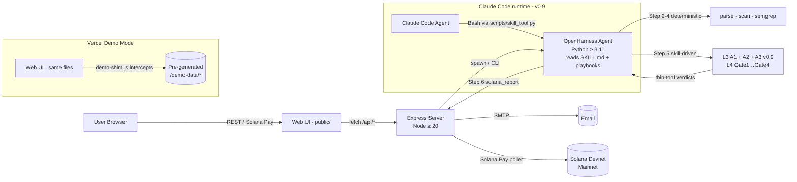

<div align="center">

# SolGuard

**AI-powered security audit for Solana smart contracts.**
**Affordable · Open-source · Instant.**

[](./LICENSE)
[](https://solana.com)
[](https://solguard-demo.vercel.app/)
[](./docs/04-SolGuard%E9%A1%B9%E7%9B%AE%E7%AE%A1%E7%90%86/)

**[简体中文](./README.zh-CN.md)** · [**Live Demo**](https://solguard-demo.vercel.app/) · [Case Studies](./docs/case-studies/) · [Docs](./docs/)

</div>

---

## Why SolGuard?

Professional Solana security audits cost **$50,000+** and take **2–4 weeks**.
**90%+ of small-to-medium projects** can't afford them — yet ship code that holds real user funds.

**SolGuard is a low-cost, open-source AI security auditor** that turns any GitHub URL / on-chain program address / whitepaper into a professional-grade risk report in **under 5 minutes** for **0.001 SOL per target** (roughly $0.20).

| | Pro Audit | SolGuard |
|---|---|---|
| Cost | $50,000+ | 0.001 SOL (~$0.20) per target |
| Turnaround | 2–4 weeks | < 5 min |
| Coverage | Deep, human | 7 deterministic rules + skill-first L3/L4 AI judgment (4 gates + 5 thin tools) |
| Availability | Booking required | 24/7 self-serve |

---

## Try it in 30 seconds

Click **[solguard-demo.vercel.app](https://solguard-demo.vercel.app/)** — a fully-playable demo runs entirely in your browser (mock wallet, 3 pre-generated case reports). No SOL needed, no Phantom install, no keys. You can submit any input, walk through the full Submit → Pay → Progress → Report flow, and inspect the three-tier audit output for each of the bundled cases.

| Case | Contract | Findings | Mode |
|---|---|---|---|
| [01 · Arbitrary CPI](./docs/case-studies/01-multi-vuln-cpi/) | 51-line Anchor (Sealevel §5) | **1 Critical** | Demo-canned |
| [02 · Clean Escrow](./docs/case-studies/02-clean-escrow/) | 172-line Anchor | 0 | Demo-canned |
| [03 · Staking Slice](./docs/case-studies/03-staking-slice/) | 312-line Anchor + legacy path | 2 High · 1 Medium | Demo-canned |

> **Demo Mode caveat** — the hosted demo replays frozen reports. To run a real end-to-end scan against your own contract, self-host the stack (see [Quick Start](#quick-start)). The demo is feature-complete for UI exploration but does *not* call the LLM or execute the audit pipeline.

---

## Features

- **4 input types** — GitHub repo · on-chain program address · whitepaper URL · project website
- **7 Solana-specific rules** — Missing Signer Check · Missing Owner Check · Arbitrary CPI · Integer Overflow · Account Data Matching · PDA Derivation Error · Uninitialized Account
- **Skill-first L3/L4 AI judgment** (v0.9) — Agent plays *A1 Prompt Explorer* + *A2 KB Checklist* + *A3 Deep-Dive* per `references/l3-agents-playbook.md`, then runs the 4-gate L4 (Kill-Signal → Counter-Question 6Q → Attack Scenario 6-step → 7-Question Gate) per `l4-judge-playbook.md`; five deterministic Python *thin tools* land every gate's verdict with zero LLM surprises. **A3 Deep-Dive** (v0.9) catches sibling-drift / cross-cpi-taint / callee-arith / authority-drop blind spots A1/A2 cannot see from a single-handler view. **Gate1/Gate4 hardening** (v0.9): Gate1 skip-matches when scope unresolvable (was: full-file fallback → over-KILL); Gate4 Q3 returns provisional PASS for `rule_id=null` (was: unilateral KILL of A1 novel findings). Phase 6 baseline → round 2 lifted F1 from **0.46 → 0.71** (recall **0.71 → 0.94**, precision **0.34 → 0.57**), avg run **12.9 s → 11.4 s**.
- **Multi-runtime SKILL** (v0.9) — runs natively on **OpenHarness Agent** (`oh -p`) AND **Claude Code** (via `scripts/skill_tool.py` stdin/stdout JSON dispatcher; symlink installation into `~/.claude/skills/`).
- **3-tier report** — Risk Summary (executive) · Contract Assessment (technical) · Audit Checklist (actionable)
- **Solana Pay checkout** — native in-wallet payment in < 10 seconds, Devnet or Mainnet
- **Email delivery + feedback loop** — reports sent to your inbox; signed feedback closes the loop
- **Batch submissions** — audit up to 5 targets in one atomic payment (frontend-enforced; the backend schema accepts 1–5)
- **Swagger / OpenAPI 3** — machine-readable API spec at [`solguard-server/openapi.yaml`](./solguard-server/openapi.yaml)

---

## Architecture



Step 5 is **skill-driven**: the Agent itself plays A1 / A2 / **A3** (v0.9) / Gate-2 / Gate-3 per two markdown playbooks, and five deterministic thin tools (`solana_kill_signal` / `solana_cq_verdict` / `solana_attack_classify` / `solana_seven_q` / `solana_judge_lite`) land every verdict. **A3 Deep-Dive** runs after A1+A2 merge to catch sibling-drift / cross-cpi-taint / callee-arith / authority-drop blind spots; auto-skips with **0 LLM cost** when A1+A2 yield no candidates. **Multi-runtime** (v0.9): the SKILL also runs natively on Claude Code via `scripts/skill_tool.py` stdin/stdout JSON dispatcher (symlink installation). Legacy `solana_ai_analyze` is kept `deprecated:true` only for benchmark replay.

Full architecture + ADRs: [`docs/ARCHITECTURE.md`](./docs/ARCHITECTURE.md).

---

## Repository Layout

```
SolGuard/
├── solguard-server/                # Express + TS backend + static UI
│   ├── src/                        # server.ts · routes · audit-engine · payment · email
│   ├── public/                     # single-page Web UI (also deployed to Vercel as demo)
│   ├── tests/
│   └── openapi.yaml                # OpenAPI 3 spec
├── skill/
│   └── solana-security-audit-skill/
│       ├── SKILL.md                # Skill-first SOP · v0.8 · nine tools
│       ├── skill.yaml              # tool manifest for OpenHarness & fallback runner
│       ├── tools/                  # solana_parse · solana_scan · solana_semgrep · solana_kill_signal
│       │   │                        #  · solana_cq_verdict · solana_attack_classify · solana_seven_q
│       │   │                        #  · solana_judge_lite · solana_report (+ solana_ai_analyze deprecated)
│       │   └── rules/              # 7 security rules
│       ├── ai/                     # judge/ (Gate1 + Gate4 + llm_shim) · analyzer.py (legacy)
│       │   └── agents/             # Candidate dataclass only — A1/A2 logic lives in playbooks
│       ├── references/             # l3-agents-playbook · l4-judge-playbook · vuln patterns · templates
│       └── tests/                  # 107 pass / 2 skip · incl. test_skill_playbook_smoke.py e2e
├── test-fixtures/                  # seed + real-world benchmark contracts
├── scripts/                        # verify · setup · deploy · benchmark
├── docs/
│   ├── ARCHITECTURE.md             # system diagram + ADRs
│   ├── USAGE.md / USAGE.zh-CN.md   # end-user guide + FAQ
│   ├── case-studies/               # 3 pre-generated audit reports
│   ├── demo/                       # demo script + slidev deck
│   └── knowledge/                  # vulnerability knowledge base
├── outputs/                        # benchmark + phase-baseline reports
└── .env.example
```

---

## Quick Start

### Prerequisites

- **Node.js** ≥ 20
- **[uv](https://docs.astral.sh/uv/)** ≥ 0.4 — **the only supported Python toolchain for SolGuard**
  - uv manages the Python interpreter (3.11, pinned via `.python-version`), virtualenv, dependencies and `uv.lock`.
  - `pip` / `venv` / `poetry` / `conda` are **not** supported as the primary workflow.
- **Solana CLI** (for Devnet testing)
- **OpenHarness** — installed through uv: `uv tool install openharness-ai`
- Anthropic or OpenAI API key

> No uv yet?
>
> ```bash
> curl -LsSf https://astral.sh/uv/install.sh | sh   # or:  brew install uv
> ```

### Setup

```bash
git clone https://github.com/Keybird0/SolGuard.git
cd SolGuard

# One-shot setup (auto-checks uv, runs `npm install` + `uv sync`,
# then executes the Phase 1 verification script)
bash scripts/setup.sh

# Or manually:
cp .env.example .env                              # fill in secrets
cd solguard-server && npm install && cd ..
cd skill/solana-security-audit-skill
uv sync --extra test                              # creates .venv + installs deps from uv.lock
```

### Run locally

```bash
# Backend
cd solguard-server && npm run dev
# → open http://localhost:3000

# Skill commands — always via `uv run` (no `activate` needed)
cd skill/solana-security-audit-skill
uv run pytest -q
uv run ruff check .
```

### Verify Phase 1 setup

```bash
bash scripts/verify-phase1.sh
```

### Dependency management cheatsheet (Python)

```bash
cd skill/solana-security-audit-skill

uv sync                   # install runtime + dev deps (reads pyproject.toml + uv.lock)
uv sync --extra test      # + pytest stack
uv sync --extra parser    # + tree-sitter-rust (Phase 6 optional parser)
uv add pydantic-settings  # add a runtime dep (updates pyproject.toml + uv.lock)
uv add --dev pytest-mock  # add a dev-only dep
uv remove tenacity        # remove a dep
uv lock                   # refresh the lockfile without syncing
uv lock --check           # CI guard: fail if lock and pyproject drift
uv run <any-command>      # run inside the managed venv

# Generate pip-compatible requirements (for platforms that only speak pip)
uv export --format requirements-txt --no-hashes --no-dev > requirements.txt
```

> `uv.lock` is the source of truth — **commit it** with every dependency change.

Full guide: [`docs/USAGE.md`](./docs/USAGE.md) (English) / [`docs/USAGE.zh-CN.md`](./docs/USAGE.zh-CN.md) (中文).

---

## Supported Vulnerabilities

Rules are implemented in [`skill/solana-security-audit-skill/tools/rules/`](./skill/solana-security-audit-skill/tools/rules/) and validated on 17 fixtures (12 real-world + 5 seed) from the Sealevel-Attacks-like corpus. Each rule hit is low-confidence by design — the final call comes from the skill-first L3/L4 judgment in Step 5.

| # | Rule | Severity | Status |
|---|------|----------|--------|
| 1 | Missing Signer Check | High | ✅ |
| 2 | Missing Owner Check | High | ✅ |
| 3 | Integer Overflow | Medium | ✅ |
| 4 | Arbitrary CPI | Critical | ✅ |
| 5 | Account Data Matching | High | ✅ |
| 6 | PDA Derivation Error | High | ✅ |
| 7 | Uninitialized Account | Medium | ✅ |

Deep-dive per rule (definition · bad/good code · detection notes · external refs): [`docs/knowledge/solana-vulnerabilities.md`](./docs/knowledge/solana-vulnerabilities.md).

### Skill-first L3/L4 judgment pipeline (Step 5, v0.9)

The M1 Step-5 "one black-box LLM call" was refactored into two markdown playbooks + five deterministic thin tools (April 2026, v0.8). v0.9 (2026-04-26) adds A3 Deep-Dive as a third L3 agent, hardens Gate1's scope fallback (skip-match instead of file-wide regex), and softens Gate4 Q3 to provisional PASS for `rule_id=null` so A1 novel findings are not unilaterally killed. The Agent plays A1 / A2 / A3 / Gate-2 / Gate-3 directly; Python only does the mechanical landing work.

| Stage | Plays | Tool | LLM? |
|---|---|---|---|
| L3 · A1 Prompt Explorer (temp 0.6, open prompt) | Agent per `references/l3-agents-playbook.md §1` | — | yes (Agent) |
| L3 · A2 KB Checklist (temp 0.1, strict JSON) | Agent per `l3-agents-playbook.md §2` | — | yes (Agent) |
| L3 · A3 Deep-Dive (temp 0.2, after A1+A2 merge) | Agent per `l3-agents-playbook.md §3` — covers sibling-drift / cross-cpi-taint / callee-arith / authority-drop blind spots | — | yes (Agent, conditional) |
| L3 · Merge | Agent (dedup by `(rule_id, location)` + severity high-water-mark; A3's `→`-bearing reason wins on collision) | — | no |
| L4 Gate 1 · Kill Signal | regex + AST over KB `kill_signals[]` | `solana_kill_signal` | no |
| L4 Gate 2 · Counter-Question 6Q | Agent per `l4-judge-playbook.md §2`; mandatory on every High/Critical | `solana_cq_verdict` lands the kill/downgrade/keep action table | yes (Agent) |
| L4 Gate 3 · Attack Scenario 6-step | Agent per `l4-judge-playbook.md §3`; empty CALL / RESULT ⇒ KILL; negative NET-ROI ⇒ DOWNGRADE | `solana_attack_classify` | yes (Agent) |
| L4 Gate 4 · 7-Question Gate | deterministic 7-question composition (reuses Gate 2 / Gate 3 ledger) | `solana_seven_q` | no |
| Post-proc | dedup + severity floor + provenance metadata | `solana_judge_lite` | no |

**Phase 6 impact** (on 17 fixtures, `round2-prompt` cold run):

| Aggregate | baseline | round 2 | Δ |
|---|---:|---:|---:|
| Precision | 0.34 | 0.57 | **+0.23** |
| Recall | 0.71 | 0.94 | **+0.23** |
| F1 | 0.46 | 0.71 | **+0.25** |
| Avg seconds / fixture | 12.88 | 11.39 | **−1.49** |

Full breakdown: [`outputs/phase6-comparison.md`](./outputs/phase6-comparison.md).

---

## API

SolGuard exposes an OpenAPI 3 REST API. Spec: [`solguard-server/openapi.yaml`](./solguard-server/openapi.yaml). When the server is running locally, Swagger UI is served at `http://localhost:3000/docs`.

Key endpoints:

| Method | Path | Purpose |
|---|---|---|
| `POST` | `/api/audit` | Submit a batch of 1–5 targets |
| `GET` | `/api/audit/batch/:batchId` | Poll batch status + per-task progress |
| `POST` | `/api/audit/batch/:batchId/payment` | Submit a Solana Pay signature for verification |
| `GET` | `/api/audit/:taskId/report.md` | Fetch the 3-tier Markdown report |
| `GET` | `/api/audit/:taskId/report.json` | Machine-readable findings + stats |
| `POST` | `/api/feedback` | Submit a signed Ed25519 feedback message |
| `GET` | `/healthz` | Liveness / readiness probe |

---

## Roadmap

- **Phase 1** — Environment & scaffolding ✅
- **Phase 2** — Skill + 7 rules + AI analyzer ✅
- **Phase 3** — Express server + payment + email ✅
- **Phase 4** — Web UI ✅
- **Phase 5** — Integration + deployment ✅
- **Phase 6** — Benchmark + accuracy tuning ✅
- **Phase 7** — Docs + demo + submission ✅ (12/12 · all in-repo docs landed; video + GitHub Release + hackathon form held for manual execution)
- **M1 · Skill-first L3/L4 refactor (2026-04-25)** ✅ — two markdown playbooks + five deterministic thin tools replace the single `solana_ai_analyze` black box; net −1100 lines of Python / +600 lines of Agent-readable SOP.
- **M2 · A3 Deep-Dive Agent + Gate1/4 hardening + Claude Code dispatcher (2026-04-26, v0.9)** ✅ — A3 lands as `references/l3-agents-playbook.md §3` (sibling-drift / cross-cpi-taint / callee-arith / authority-drop, 0 new Python tool); Gate1 stops file-wide fallback when scope is unresolvable; Gate4 Q3 stops killing A1 novel `rule_id=null` candidates; `scripts/skill_tool.py` makes the SKILL runnable on Claude Code via symlink install. Verified end-to-end on 5 targets (3 sealevel + 1 inline Cashio PoC + 1 real SPL Token).

**Forward-looking optimisation themes** (non-binding, evaluated against the v0.9 baseline):

1. **VF-001 · KB completeness** — `knowledge/solana_bug_patterns.json` is missing an `integer_overflow` pattern, so Gate4 Q3 KILLs valid integer_overflow candidates. Surfaced by the v0.9 verification batch (`outputs/verifi/SUMMARY.md`). Fix: add ~50 lines of KB JSON for that pattern.
2. **M3 · RAG / memory** — orthogonal to the skill-first refactor; plug into A2 Checklist to retrieve pattern-specific exemplars from past audits. Trigger: case pool ≥ 100 real audits.
3. **Benchmark determinism** — Gate 2 / Gate 3 carry LLM variance; if future hackathons need hard reproducibility, pin `round2-prompt` results via the legacy `solana_ai_analyze` path (still available under `deprecated:true`).
4. **Cost guardrails** — per-task budget (`SOLANA_AUDIT_BUDGET`) and Medium-severity sampling rate (`0.25` by default in `l4-judge-playbook.md §2.5`) are the two levers; per-project budget accounting still TODO.
5. **Frontend polish** — keep the UI aligned with 1–5 target batches; add per-gate status beacons in the progress stepper so users can see "Gate 2 · 3/5 done".
6. **A3 v2 cross-file** — current A3 stays inside the supplied file; cross-file callgraph slicing is reserved for A3 v2 once we have a tree-sitter-rust dep (`uv sync --extra parser`).

See the full plan + milestones in [`docs/04-SolGuard项目管理/`](../docs/04-SolGuard%E9%A1%B9%E7%9B%AE%E7%AE%A1%E7%90%86/) and the iteration evaluation in [`docs/03-现有材料与项目规划/03-SolGuard项目开发规划.md §13`](../docs/03-%E7%8E%B0%E6%9C%89%E6%9D%90%E6%96%99%E4%B8%8E%E9%A1%B9%E7%9B%AE%E8%A7%84%E5%88%92/03-SolGuard%E9%A1%B9%E7%9B%AE%E5%BC%80%E5%8F%91%E8%A7%84%E5%88%92.md).

---

## Contributing

Contributions welcome! See [`CONTRIBUTING.md`](./CONTRIBUTING.md).

Rough workflow:
1. Fork & clone
2. `bash scripts/setup.sh`
3. Create a feature branch
4. Commit via [Conventional Commits](https://www.conventionalcommits.org/)
5. Open a PR

---

## License

SolGuard is released under the **[MIT License](./LICENSE)** — see
[`LICENSE`](./LICENSE) for the full text.

```
SPDX-License-Identifier: MIT
Copyright (c) 2026 SolGuard Contributors
```

Third-party dependencies retain their original licenses; see
[`LICENSE-THIRD-PARTY.md`](./LICENSE-THIRD-PARTY.md) and
[`NOTICE`](./NOTICE).

---

## Credits

SolGuard stands on the shoulders of giants:

- **[OpenHarness](https://github.com/HKUDS/OpenHarness)** — Agent infrastructure
- **[GoatGuard](https://github.com/Reappear/GoatGuard)** — EVM audit architecture reference
- **[Sealevel Attacks](https://github.com/coral-xyz/sealevel-attacks)** — Security benchmark
- **Solana Foundation** — Docs & community
