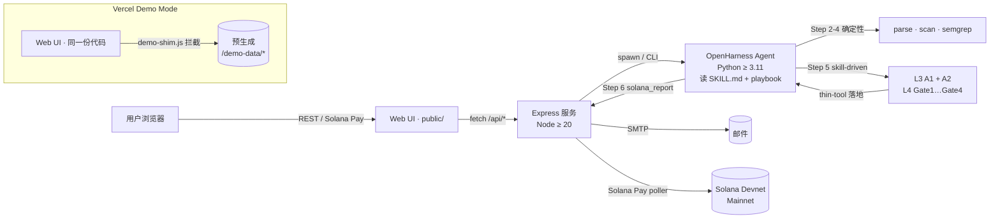

<div align="center">

# SolGuard

**AI 驱动的 Solana 智能合约安全审计服务。**
**低成本 · 开源 · 即时。**

[](./LICENSE)
[](https://solana.com)
[](https://solguard-demo.vercel.app/)
[](./docs/04-SolGuard%E9%A1%B9%E7%9B%AE%E7%AE%A1%E7%90%86/)

**[English](./README.md)** · [**在线 Demo**](https://solguard-demo.vercel.app/) · [案例报告](./docs/case-studies/) · [文档](./docs/)

</div>

---

## 为什么是 SolGuard？

专业的 Solana 安全审计收费 **5 万美元起**，周期 **2-4 周**。
**90% 以上的中小项目负担不起**，但它们的代码仍承载着真实用户资金。

**SolGuard 是一款低成本开源的 AI 安全审计器**，把任意 GitHub URL / 合约地址 / 白皮书，在 **5 分钟内**、以 **每个目标 0.001 SOL（约 0.2 美元）** 的成本，生成一份专业级风险报告。

| | 专业审计 | SolGuard |
|---|---|---|
| 价格 | $50,000+ | 每目标 0.001 SOL (~$0.2) |
| 周期 | 2-4 周 | < 5 分钟 |
| 覆盖 | 深度、人工 | 7 条确定性规则 + Skill-first L3/L4 AI 研判（4 闸 + 5 thin tool） |
| 可用性 | 需预约 | 7×24 自助 |

---

## 30 秒先玩为敬

点击 **[solguard-demo.vercel.app](https://solguard-demo.vercel.app/)** — 一个完整可玩的 Demo，全部在浏览器里跑（mock 钱包、3 份预生成案例报告）。不需要 SOL，不需要装 Phantom，不需要任何密钥。你可以提交任意输入，完整走一遍 提交 → 付款 → 进度 → 报告 的流程，并查看每个案例的三级审计输出。

| 案例 | 合约 | 发现 | 模式 |
|---|---|---|---|
| [01 · Arbitrary CPI](./docs/case-studies/01-multi-vuln-cpi/) | 51 行 Anchor (Sealevel §5) | **1 Critical** | 预生成 |
| [02 · Clean Escrow](./docs/case-studies/02-clean-escrow/) | 172 行 Anchor | 0 | 预生成 |
| [03 · Staking Slice](./docs/case-studies/03-staking-slice/) | 312 行 Anchor + legacy | 2 High · 1 Medium | 预生成 |

> **Demo Mode 说明** — 托管 demo 回放的是预生成报告。想对自己的合约跑真实端到端扫描，请自托管（见 [快速开始](#快速开始)）。Demo 展示完整 UI 流程，但**不**调用 LLM、**不**执行真实审计管线。

---

## 核心功能

- **4 类输入** — GitHub 仓库 · 链上程序地址 · 白皮书 URL · 项目官网
- **7 条 Solana 专属规则** — Signer 检查缺失 · Owner 检查缺失 · 任意 CPI · 整数溢出 · 账户数据匹配 · PDA 派生错误 · 未初始化账户
- **Skill-first L3/L4 AI 研判**（v0.9）— 由外层 Agent 按 `references/l3-agents-playbook.md` 自主扮演 *A1 Prompt Explorer* + *A2 KB Checklist* + *A3 Deep-Dive*，再按 `l4-judge-playbook.md` 依次跑 **Kill-Signal → Counter-Question 六问 → Attack Scenario 六步 → 7-Question Gate** 四闸；五个确定性 Python *thin tool* 负责落地每一步判决。**A3 Deep-Dive**（v0.9）专攻 A1/A2 单 handler 视角看不到的 4 类盲点：sibling-drift / cross-cpi-taint / callee-arith / authority-drop。**Gate1/Gate4 加固**（v0.9）：Gate1 在 scope 不可解析时改为 skip-match（之前回退到全文件 regex 易误杀）；Gate4 Q3 对 `rule_id=null` 的 A1 novel finding 改为 provisional PASS（之前会被单独 KILL）。Phase 6 基线 → Round 2，F1 从 **0.46 → 0.71**，召回 **0.71 → 0.94**，精确率 **0.34 → 0.57**，平均耗时 **12.9 s → 11.4 s**。
- **多运行时 SKILL**（v0.9）— SKILL 既支持 **OpenHarness Agent**（`oh -p`），也支持 **Claude Code**（通过 `scripts/skill_tool.py` stdin/stdout JSON 调度器；软链装入 `~/.claude/skills/`）。
- **三级报告** — 风险总结（高管视角）· 合约评估（技术详情）· 审计清单（可执行）
- **Solana Pay 结账** — 钱包内原生支付，10 秒完成，支持 Devnet / Mainnet
- **邮件通知 + 反馈闭环** — 报告直接送达邮箱；签名反馈闭环
- **批量提交** — 一次原子支付最多审计 5 个目标（前端限制；后端 schema 接受 1–5）
- **Swagger / OpenAPI 3** — 机器可读 API spec 位于 [`solguard-server/openapi.yaml`](./solguard-server/openapi.yaml)

---

## 架构



Step 5 是 **skill-driven**：Agent 自己扮演 A1 / A2 / Gate-2 / Gate-3，遵循两份 markdown playbook；五个确定性 thin tool（`solana_kill_signal` / `solana_cq_verdict` / `solana_attack_classify` / `solana_seven_q` / `solana_judge_lite`）负责把每个 gate 的判决落地。原 `solana_ai_analyze` 标记 `deprecated:true`，仅保留 benchmark 回放使用。

完整架构 + ADR：[`docs/ARCHITECTURE.md`](./docs/ARCHITECTURE.md)。

---

## 仓库结构

```
SolGuard/
├── solguard-server/                # Express + TS 后端 + 静态 UI
│   ├── src/                        # server · routes · audit-engine · payment · email
│   ├── public/                     # 单页 Web UI（同份代码部署到 Vercel demo）
│   ├── tests/
│   └── openapi.yaml                # OpenAPI 3 规范
├── skill/
│   └── solana-security-audit-skill/
│       ├── SKILL.md                # Skill-first SOP · v0.8 · 九个工具
│       ├── skill.yaml              # 工具清单（供 OpenHarness + 回退 runner 使用）
│       ├── tools/                  # solana_parse · solana_scan · solana_semgrep · solana_kill_signal
│       │   │                        #  · solana_cq_verdict · solana_attack_classify · solana_seven_q
│       │   │                        #  · solana_judge_lite · solana_report（另 solana_ai_analyze 已 deprecated）
│       │   └── rules/              # 7 条安全规则
│       ├── ai/                     # judge/（Gate1 + Gate4 + llm_shim）· analyzer.py（legacy）
│       │   └── agents/             # 只保留 Candidate 数据类；A1/A2 逻辑在 playbook 里
│       ├── references/             # l3-agents-playbook · l4-judge-playbook · 漏洞模式 · 模板
│       └── tests/                  # 107 pass / 2 skip · 含 test_skill_playbook_smoke.py e2e
├── test-fixtures/                  # seed + 真实世界基准合约
├── scripts/                        # verify · setup · deploy · benchmark
├── docs/
│   ├── ARCHITECTURE.md             # 系统架构 + ADR
│   ├── USAGE.md / USAGE.zh-CN.md   # 用户指南 + FAQ
│   ├── case-studies/               # 3 份预生成审计报告
│   ├── demo/                       # 演示脚本 + slidev deck
│   └── knowledge/                  # 漏洞知识库
├── outputs/                        # 基准 + phase-baseline 报告
└── .env.example
```

---

## 快速开始

### 环境要求

- **Node.js** ≥ 20
- **[uv](https://docs.astral.sh/uv/)** ≥ 0.4 — **SolGuard 唯一指定的 Python 工具链**
  - Python 版本由 `.python-version` 固定为 **3.11**，由 uv 自动下载解释器
  - 依赖真相源是 `pyproject.toml` + `uv.lock`，**`uv.lock` 必须提交**
  - 禁止把 `pip` / `python -m venv` / `poetry` / `conda` 作为主流程
- **Solana CLI**（Devnet 联调）
- **OpenHarness** — 用 uv 安装：`uv tool install openharness-ai`
- Anthropic 或 OpenAI API Key

> 还没装 uv？
>
> ```bash
> curl -LsSf https://astral.sh/uv/install.sh | sh   # 或：brew install uv
> ```

### 初始化

```bash
git clone https://github.com/Keybird0/SolGuard.git
cd SolGuard

# 一键：检查 uv、装 npm 依赖、执行 `uv sync`、跑 Phase 1 验收脚本
bash scripts/setup.sh

# 或手动：
cp .env.example .env                              # 填写密钥
cd solguard-server && npm install && cd ..
cd skill/solana-security-audit-skill
uv sync --extra test                              # 按 uv.lock 生成 .venv + 安装依赖
```

### 本地运行

```bash
# 后端
cd solguard-server && npm run dev
# 打开 http://localhost:3000

# Skill 下的所有 Python 命令都走 uv run（无需 source .venv）
cd skill/solana-security-audit-skill
uv run pytest -q
uv run ruff check .
```

### 依赖管理速查（Python 专用）

```bash
cd skill/solana-security-audit-skill

uv sync                   # 默认同步（runtime + dev）
uv sync --extra test      # 加上测试 extra
uv sync --extra parser    # 加上 tree-sitter-rust（Phase 6 可选解析器）
uv add pydantic-settings  # 新增依赖（自动更新 pyproject.toml + uv.lock）
uv add --dev pytest-mock  # 新增 dev-only 依赖
uv remove tenacity        # 删除依赖
uv lock                   # 仅刷新 uv.lock
uv lock --check           # CI 守卫：pyproject 与 lock 不一致直接失败
uv run <任意命令>          # 在托管的 venv 内执行

# 导出 pip 兼容 requirements（给只认 pip 的部署平台用）
uv export --format requirements-txt --no-hashes --no-dev > requirements.txt
```

完整指南：[`docs/USAGE.zh-CN.md`](./docs/USAGE.zh-CN.md)。

---

## 支持的漏洞规则

规则实现位于 [`skill/solana-security-audit-skill/tools/rules/`](./skill/solana-security-audit-skill/tools/rules/)，已在 Sealevel-Attacks 类语料库的 17 个 fixture（12 真实世界 + 5 seed）上完成回归。每条规则命中都是低置信度 *hint*——最终判决由 Step 5 的 Skill-first L3/L4 研判给出。

| # | 规则 | 严重度 | 状态 |
|---|------|-------|-----|
| 1 | Missing Signer Check | High | ✅ |
| 2 | Missing Owner Check | High | ✅ |
| 3 | Integer Overflow | Medium | ✅ |
| 4 | Arbitrary CPI | Critical | ✅ |
| 5 | Account Data Matching | High | ✅ |
| 6 | PDA Derivation Error | High | ✅ |
| 7 | Uninitialized Account | Medium | ✅ |

每条规则的定义 / bad code / good code / 检测注意事项 / 外链：[`docs/knowledge/solana-vulnerabilities.md`](./docs/knowledge/solana-vulnerabilities.md)。

### Skill-first L3/L4 研判管线（Step 5，v0.9）

M1 阶段"一次黑盒 `solana_ai_analyze`"在 2026-04 被重构为两份 markdown playbook + 五个确定性 thin tool（v0.8）。v0.9（2026-04-26）新增 A3 Deep-Dive 作为第三个 L3 Agent，加固 Gate1 scope fallback（不再回退全文件 regex），软化 Gate4 Q3（`rule_id=null` 不再单独 KILL）。Agent 自己扮演 A1 / A2 / A3 / Gate-2 / Gate-3；Python 只做机械落地。

| 阶段 | 由谁扮演 | Tool | 是否 LLM |
|---|---|---|---|
| L3 · A1 Prompt Explorer（temp 0.6，开放式提示） | Agent 按 `references/l3-agents-playbook.md §1` | — | 是（Agent） |
| L3 · A2 KB Checklist（temp 0.1，严格 JSON） | Agent 按 `l3-agents-playbook.md §2` | — | 是（Agent） |
| L3 · A3 Deep-Dive（temp 0.2，A1+A2 merge 后） | Agent 按 `l3-agents-playbook.md §3` — 覆盖 sibling-drift / cross-cpi-taint / callee-arith / authority-drop 4 类盲点 | — | 是（Agent，条件触发） |
| L3 · Merge | Agent 按 `(rule_id, location)` 去重 + severity 取高；A3 带 `→` 路径的 reason 优先覆盖 | — | 否 |
| L4 Gate 1 · Kill Signal | 对 KB `kill_signals[]` 做正则 + AST | `solana_kill_signal` | 否 |
| L4 Gate 2 · Counter-Question 六问 | Agent 按 `l4-judge-playbook.md §2`，每条 High/Critical 必过 | `solana_cq_verdict`（KILL/DOWNGRADE/KEEP 落地 + severity floor） | 是（Agent） |
| L4 Gate 3 · Attack Scenario 六步 | Agent 按 `l4-judge-playbook.md §3`，CALL/RESULT 为空 ⇒ KILL，NET-ROI < 1 ⇒ DOWNGRADE | `solana_attack_classify` | 是（Agent） |
| L4 Gate 4 · 7-Question Gate | 纯逻辑组合（复用 Gate 2/3 结果） | `solana_seven_q` | 否 |
| 后处理 | 去重 + severity floor + provenance 元数据 | `solana_judge_lite` | 否 |

**Phase 6 指标**（17 fixture，`round2-prompt` cold run）：

| 聚合 | baseline | round 2 | Δ |
|---|---:|---:|---:|
| 精确率 | 0.34 | 0.57 | **+0.23** |
| 召回率 | 0.71 | 0.94 | **+0.23** |
| F1 | 0.46 | 0.71 | **+0.25** |
| 平均耗时（秒/fixture） | 12.88 | 11.39 | **−1.49** |

详细对比：[`outputs/phase6-comparison.md`](./outputs/phase6-comparison.md)。

---

## API

SolGuard 提供 OpenAPI 3 REST API。规范文件：[`solguard-server/openapi.yaml`](./solguard-server/openapi.yaml)。本地运行后端时，Swagger UI 位于 `http://localhost:3000/docs`。

| Method | Path | 用途 |
|---|---|---|
| `POST` | `/api/audit` | 提交 1–5 个目标为一个 batch |
| `GET` | `/api/audit/batch/:batchId` | 轮询 batch 状态 + 每个 task 的进度 |
| `POST` | `/api/audit/batch/:batchId/payment` | 提交 Solana Pay 签名做链上校验 |
| `GET` | `/api/audit/:taskId/report.md` | 获取三级 Markdown 报告 |
| `GET` | `/api/audit/:taskId/report.json` | 机器可读 findings + 统计 |
| `POST` | `/api/feedback` | 提交 Ed25519 签名反馈 |
| `GET` | `/healthz` | 健康检查 |

---

## 路线图

- **Phase 1** — 环境与骨架 ✅
- **Phase 2** — Skill + 7 条规则 + AI 分析器 ✅
- **Phase 3** — 后端 + 支付 + 邮件 ✅
- **Phase 4** — Web UI ✅
- **Phase 5** — 集成 + 部署 ✅
- **Phase 6** — 基准测试 + 准确率调优 ✅
- **Phase 7** — 文档 + 演示 + 提交 ✅（12/12，仓库内文档全部交付；演示视频 / GitHub Release / 黑客松提交为用户手动项）
- **M1 · Skill-first L3/L4 重构（2026-04-25）** ✅ — 2 份 playbook + 5 个确定性 thin tool 替换原 `solana_ai_analyze` 黑盒；净 Python −1100 行 / +600 行 Agent 可读 SOP。
- **M2 · A3 Deep-Dive Agent + Gate1/4 加固 + Claude Code dispatcher（2026-04-26，v0.9）** ✅ — A3 按 playbook 形式落地为 `references/l3-agents-playbook.md §3`（sibling-drift / cross-cpi-taint / callee-arith / authority-drop，0 行新 Python）；Gate1 scope 不可解析时不再回退全文件；Gate4 Q3 不再单独 KILL `rule_id=null` 候选；`scripts/skill_tool.py` 让 SKILL 通过软链装入 `~/.claude/skills/` 即可在 Claude Code 内运行。在 5 个目标（3 sealevel + 1 inline Cashio PoC + 1 真实 SPL Token）上端到端验证通过。

**后续迭代方向评估**（相对于 v0.9 基线）：

1. **VF-001 · KB 完整性** — `knowledge/solana_bug_patterns.json` 缺 `integer_overflow` 模式，导致 Gate4 Q3 把合法的 integer_overflow 候选 KILL 掉。v0.9 verification 跑批中暴露（详见 `outputs/verifi/SUMMARY.md`）。修复：补 ~50 行 KB JSON。
2. **M3 · RAG / Memory** — 与 skill-first 正交；接入 A2 KB Checklist，从历史审计库检索 pattern 样例。触发条件：案例池累计 ≥ 100 真实审计。
3. **基准可复现性** — Gate 2 / Gate 3 引入 LLM 抖动；若后续需要硬复现，通过 legacy `solana_ai_analyze`（`deprecated:true` 仍可用）固化 `round2-prompt` 数值。
4. **成本护栏** — 单 task 预算（`SOLANA_AUDIT_BUDGET`）和 Medium 采样率（`l4-judge-playbook.md §2.5` 默认 `0.25`）是两个主要杠杆；项目级预算账本仍 TODO。
5. **前端打磨** — 确保 UI 与 1–5 target batch 对齐；在进度 stepper 增加按 gate 的状态灯（"Gate 2 · 3/5 完成"）。
6. **A3 v2 跨文件** — 当前 A3 限当前文件内；跨文件 callgraph 切片留 A3 v2，依赖 tree-sitter-rust（`uv sync --extra parser`）。

详见 [`docs/04-SolGuard项目管理/`](../docs/04-SolGuard%E9%A1%B9%E7%9B%AE%E7%AE%A1%E7%90%86/) 和迭代评估 [`docs/03-现有材料与项目规划/03-SolGuard项目开发规划.md §13`](../docs/03-%E7%8E%B0%E6%9C%89%E6%9D%90%E6%96%99%E4%B8%8E%E9%A1%B9%E7%9B%AE%E8%A7%84%E5%88%92/03-SolGuard%E9%A1%B9%E7%9B%AE%E5%BC%80%E5%8F%91%E8%A7%84%E5%88%92.md)。

---

## 贡献

欢迎贡献！详见 [`CONTRIBUTING.md`](./CONTRIBUTING.md)。

简要流程：
1. Fork 仓库并 clone
2. `bash scripts/setup.sh`
3. 新建 feature 分支
4. 使用 [Conventional Commits](https://www.conventionalcommits.org/) 提交
5. 开 PR

---

## 许可证

SolGuard 以 **[MIT License](./LICENSE)** 开源发布，完整协议见
[`LICENSE`](./LICENSE) 文件。

```
SPDX-License-Identifier: MIT
Copyright (c) 2026 SolGuard Contributors
```

第三方依赖各自保留原有协议，详见
[`LICENSE-THIRD-PARTY.md`](./LICENSE-THIRD-PARTY.md) 与
[`NOTICE`](./NOTICE)。

---

## 致谢

- **[OpenHarness](https://github.com/HKUDS/OpenHarness)** — Agent 基础设施
- **[GoatGuard](https://github.com/Reappear/GoatGuard)** — EVM 审计架构参考
- **[Sealevel Attacks](https://github.com/coral-xyz/sealevel-attacks)** — 安全基准
- **Solana Foundation** — 文档与社区
