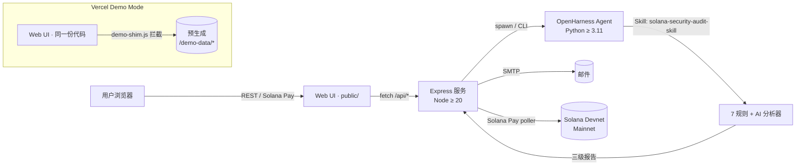

<div align="center">

# SolGuard

**AI 驱动的 Solana 智能合约安全审计服务。**
**低成本 · 开源 · 即时。**

[](./LICENSE)
[](https://solana.com)
[](https://solguard-demo.vercel.app/)
[](./docs/04-SolGuard%E9%A1%B9%E7%9B%AE%E7%AE%A1%E7%90%86/)

**[English](./README.md)** · [**在线 Demo**](https://solguard-demo.vercel.app/) · [案例报告](./docs/case-studies/) · [文档](./docs/)

</div>

---

## 为什么是 SolGuard？

专业的 Solana 安全审计收费 **5 万美元起**，周期 **2-4 周**。
**90% 以上的中小项目负担不起**，但它们的代码仍承载着真实用户资金。

**SolGuard 是一款低成本开源的 AI 安全审计器**，把任意 GitHub URL / 合约地址 / 白皮书，在 **5 分钟内**、以 **每个目标 0.01 SOL（约 2 美元）** 的成本，生成一份专业级风险报告。

| | 专业审计 | SolGuard |
|---|---|---|
| 价格 | $50,000+ | 每目标 0.01 SOL (~$2) |
| 周期 | 2-4 周 | < 5 分钟 |
| 覆盖 | 深度、人工 | 7 条确定性规则 + AI 交叉验证 |
| 可用性 | 需预约 | 7×24 自助 |

---

## 30 秒先玩为敬

点击 **[solguard-demo.vercel.app](https://solguard-demo.vercel.app/)** — 一个完整可玩的 Demo，全部在浏览器里跑（mock 钱包、3 份预生成案例报告）。不需要 SOL，不需要装 Phantom，不需要任何密钥。你可以提交任意输入，完整走一遍 提交 → 付款 → 进度 → 报告 的流程，并查看每个案例的三级审计输出。

| 案例 | 合约 | 发现 | 模式 |
|---|---|---|---|
| [01 · Arbitrary CPI](./docs/case-studies/01-multi-vuln-cpi/) | 51 行 Anchor (Sealevel §5) | **1 Critical** | 预生成 |
| [02 · Clean Escrow](./docs/case-studies/02-clean-escrow/) | 172 行 Anchor | 0 | 预生成 |
| [03 · Staking Slice](./docs/case-studies/03-staking-slice/) | 312 行 Anchor + legacy | 2 High · 1 Medium | 预生成 |

> **Demo Mode 说明** — 托管 demo 回放的是预生成报告。想对自己的合约跑真实端到端扫描，请自托管（见 [快速开始](#快速开始)）。Demo 展示完整 UI 流程，但**不**调用 LLM、**不**执行真实审计管线。

---

## 核心功能

- **4 类输入** — GitHub 仓库 · 链上程序地址 · 白皮书 URL · 项目官网
- **7 条 Solana 专属规则** — Signer 检查缺失 · Owner 检查缺失 · 任意 CPI · 整数溢出 · 账户数据匹配 · PDA 派生错误 · 未初始化账户
- **AI 深度分析 + Kill Signal** — LLM 对规则命中做二次验证（Phase 6 Sealevel 基准精确率 88%、召回率 79%）
- **三级报告** — 风险总结（高管视角）· 合约评估（技术详情）· 审计清单（可执行）
- **Solana Pay 结账** — 钱包内原生支付，10 秒完成，支持 Devnet / Mainnet
- **邮件通知 + 反馈闭环** — 报告直接送达邮箱；签名反馈闭环
- **批量提交** — 一次原子支付最多审计 3 个目标
- **Swagger / OpenAPI 3** — 机器可读 API spec 位于 [`solguard-server/openapi.yaml`](./solguard-server/openapi.yaml)

---

## 架构



完整架构 + ADR：[`docs/ARCHITECTURE.md`](./docs/ARCHITECTURE.md)。

---

## 仓库结构

```
SolGuard/
├── solguard-server/                # Express + TS 后端 + 静态 UI
│   ├── src/                        # server · routes · audit-engine · payment · email
│   ├── public/                     # 单页 Web UI（同份代码部署到 Vercel demo）
│   ├── tests/
│   └── openapi.yaml                # OpenAPI 3 规范
├── skill/
│   └── solana-security-audit-skill/
│       ├── SKILL.md                # Skill 定义 + 审计 SOP
│       ├── tools/                  # solana_parse · solana_scan · solana_ai_analyze · solana_report
│       │   └── rules/              # 7 条安全规则
│       ├── ai/                     # LLM 分析器 + prompts
│       ├── core/ · reporters/ · references/ · tests/
├── test-fixtures/                  # seed + 真实世界基准合约
├── scripts/                        # verify · setup · deploy · benchmark
├── docs/
│   ├── ARCHITECTURE.md             # 系统架构 + ADR
│   ├── USAGE.md / USAGE.zh-CN.md   # 用户指南 + FAQ
│   ├── case-studies/               # 3 份预生成审计报告
│   ├── demo/                       # 演示脚本 + slidev deck
│   └── knowledge/                  # 漏洞知识库
├── outputs/                        # 基准 + phase-baseline 报告
└── .env.example
```

---

## 快速开始

### 环境要求

- **Node.js** ≥ 20
- **[uv](https://docs.astral.sh/uv/)** ≥ 0.4 — **SolGuard 唯一指定的 Python 工具链**
  - Python 版本由 `.python-version` 固定为 **3.11**，由 uv 自动下载解释器
  - 依赖真相源是 `pyproject.toml` + `uv.lock`，**`uv.lock` 必须提交**
  - 禁止把 `pip` / `python -m venv` / `poetry` / `conda` 作为主流程
- **Solana CLI**（Devnet 联调）
- **OpenHarness** — 用 uv 安装：`uv tool install openharness-ai`
- Anthropic 或 OpenAI API Key

> 还没装 uv？
>
> ```bash
> curl -LsSf https://astral.sh/uv/install.sh | sh   # 或：brew install uv
> ```

### 初始化

```bash
git clone https://github.com/Keybird0/SolGuard.git
cd SolGuard

# 一键：检查 uv、装 npm 依赖、执行 `uv sync`、跑 Phase 1 验收脚本
bash scripts/setup.sh

# 或手动：
cp .env.example .env                              # 填写密钥
cd solguard-server && npm install && cd ..
cd skill/solana-security-audit-skill
uv sync --extra test                              # 按 uv.lock 生成 .venv + 安装依赖
```

### 本地运行

```bash
# 后端
cd solguard-server && npm run dev
# 打开 http://localhost:3000

# Skill 下的所有 Python 命令都走 uv run（无需 source .venv）
cd skill/solana-security-audit-skill
uv run pytest -q
uv run ruff check .
```

### 依赖管理速查（Python 专用）

```bash
cd skill/solana-security-audit-skill

uv sync                   # 默认同步（runtime + dev）
uv sync --extra test      # 加上测试 extra
uv sync --extra parser    # 加上 tree-sitter-rust（Phase 6 可选解析器）
uv add pydantic-settings  # 新增依赖（自动更新 pyproject.toml + uv.lock）
uv add --dev pytest-mock  # 新增 dev-only 依赖
uv remove tenacity        # 删除依赖
uv lock                   # 仅刷新 uv.lock
uv lock --check           # CI 守卫：pyproject 与 lock 不一致直接失败
uv run <任意命令>          # 在托管的 venv 内执行

# 导出 pip 兼容 requirements（给只认 pip 的部署平台用）
uv export --format requirements-txt --no-hashes --no-dev > requirements.txt
```

完整指南：[`docs/USAGE.zh-CN.md`](./docs/USAGE.zh-CN.md)。

---

## 支持的漏洞规则

规则实现位于 [`skill/solana-security-audit-skill/tools/rules/`](./skill/solana-security-audit-skill/tools/rules/)，已在 Sealevel-Attacks 语料库和 16 个真实世界 fixture 上完成回归。

| # | 规则 | 严重度 | 状态 |
|---|------|-------|-----|
| 1 | Missing Signer Check | High | ✅ |
| 2 | Missing Owner Check | High | ✅ |
| 3 | Integer Overflow | Medium | ✅ |
| 4 | Arbitrary CPI | Critical | ✅ |
| 5 | Account Data Matching | High | ✅ |
| 6 | PDA Derivation Error | High | ✅ |
| 7 | Uninitialized Account | Medium | ✅ |

每条规则的定义 / bad code / good code / 检测注意事项 / 外链：[`docs/knowledge/solana-vulnerabilities.md`](./docs/knowledge/solana-vulnerabilities.md)。

---

## API

SolGuard 提供 OpenAPI 3 REST API。规范文件：[`solguard-server/openapi.yaml`](./solguard-server/openapi.yaml)。本地运行后端时，Swagger UI 位于 `http://localhost:3000/docs`。

| Method | Path | 用途 |
|---|---|---|
| `POST` | `/api/audit` | 提交最多 3 个目标为一个 batch |
| `GET` | `/api/audit/batch/:batchId` | 轮询 batch 状态 + 每个 task 的进度 |
| `POST` | `/api/audit/batch/:batchId/payment` | 提交 Solana Pay 签名做链上校验 |
| `GET` | `/api/audit/:taskId/report.md` | 获取三级 Markdown 报告 |
| `GET` | `/api/audit/:taskId/report.json` | 机器可读 findings + 统计 |
| `POST` | `/api/feedback` | 提交 Ed25519 签名反馈 |
| `GET` | `/healthz` | 健康检查 |

---

## 路线图

- **Phase 1** — 环境与骨架 ✅
- **Phase 2** — Skill + 7 条规则 + AI 分析器 ✅
- **Phase 3** — 后端 + 支付 + 邮件 ✅
- **Phase 4** — Web UI ✅
- **Phase 5** — 集成 + 部署 ✅
- **Phase 6** — 基准测试 + 准确率调优 ✅
- **Phase 7** — 文档 + 演示 + 提交（2026-05-11） 🚧

详见 [`docs/04-SolGuard项目管理/`](../docs/04-SolGuard%E9%A1%B9%E7%9B%AE%E7%AE%A1%E7%90%86/)。

---

## 贡献

欢迎贡献！详见 [`CONTRIBUTING.md`](./CONTRIBUTING.md)。

简要流程：
1. Fork 仓库并 clone
2. `bash scripts/setup.sh`
3. 新建 feature 分支
4. 使用 [Conventional Commits](https://www.conventionalcommits.org/) 提交
5. 开 PR

---

## 许可证

SolGuard 以 **[MIT License](./LICENSE)** 开源发布，完整协议见
[`LICENSE`](./LICENSE) 文件。

```
SPDX-License-Identifier: MIT
Copyright (c) 2026 SolGuard Contributors
```

第三方依赖各自保留原有协议，详见
[`LICENSE-THIRD-PARTY.md`](./LICENSE-THIRD-PARTY.md) 与
[`NOTICE`](./NOTICE)。

---

## 致谢

- **[OpenHarness](https://github.com/HKUDS/OpenHarness)** — Agent 基础设施
- **[GoatGuard](https://github.com/Reappear/GoatGuard)** — EVM 审计架构参考
- **[Sealevel Attacks](https://github.com/coral-xyz/sealevel-attacks)** — 安全基准
- **Solana Foundation** — 文档与社区
