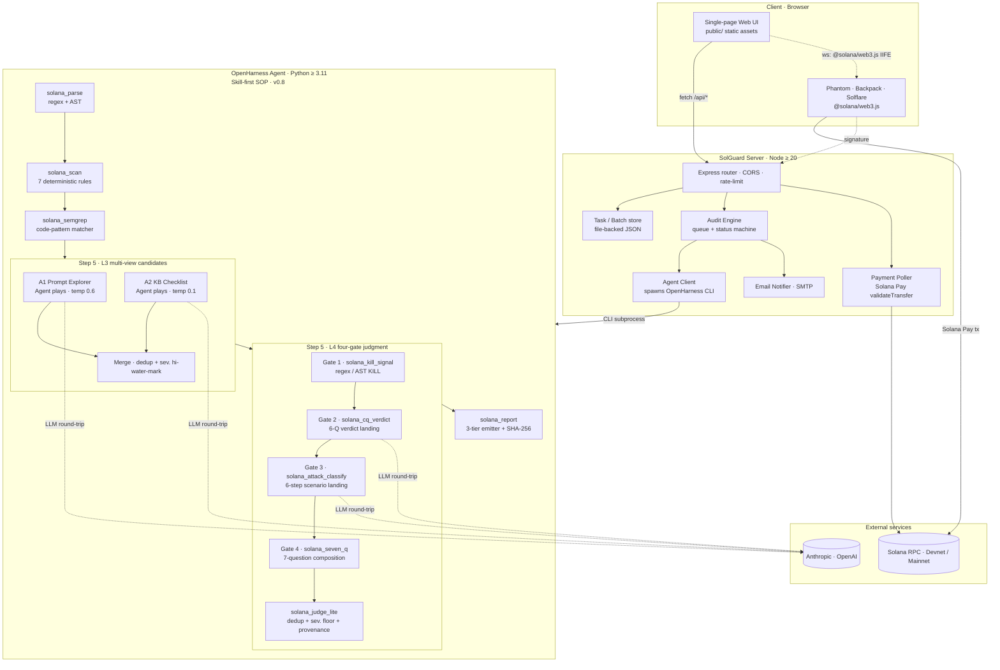
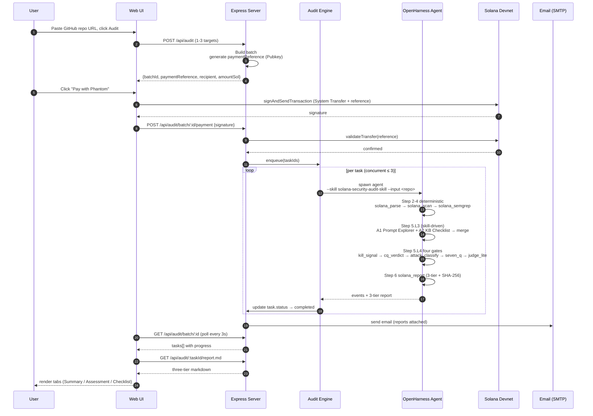

# SolGuard — System Architecture

> Version: 0.8.0 (Phase 7 · Skill-first L3/L4) · Last updated: 2026-04-25

## 1. System diagram



## 2. Data flow — end-to-end audit



## 3. Repository layout

```
SolGuard/
├── solguard-server/
│   ├── src/                 # TypeScript — one file per concern
│   │   ├── server.ts        # Express entry (healthz + /api router)
│   │   ├── audit-engine.ts  # queue + concurrency + status machine
│   │   ├── agent-client.ts  # spawns OpenHarness CLI, parses events
│   │   ├── task-store.ts    # file-backed JSON storage
│   │   ├── payment.ts       # Solana Pay validator (server-side)
│   │   ├── payment-poller.ts # background watcher for `paying` batches
│   │   ├── email.ts         # SMTP + Lark webhook notifiers
│   │   ├── normalizer.ts    # input → NormalizedInput (github / bytecode / leads)
│   │   ├── config.ts        # env var loader + defaults
│   │   └── middleware/      # rate-limit · error handler · logger
│   ├── public/              # single-page UI (static)
│   │   ├── index.html       # entry
│   │   ├── app.js           # state machine + router
│   │   ├── api.js           # fetch wrapper
│   │   ├── wallet.js        # Phantom / Backpack / Solflare
│   │   ├── payment.js       # buildPaymentTx + signAndSend
│   │   ├── report.js        # markdown render + tab split
│   │   ├── errors.js        # friendly error mapping
│   │   └── demo-shim.js     # Vercel Demo Mode interceptor
│   ├── tests/               # Vitest unit + integration
│   ├── openapi.yaml         # OpenAPI 3
│   └── package.json
│
├── skill/
│   └── solana-security-audit-skill/     # OpenHarness Skill package · v0.8 skill-first L3/L4
│       ├── SKILL.md                     # entry + SOP · Step 5 delegates to playbooks
│       ├── skill.yaml                   # tool manifest (9 tools + 1 deprecated)
│       ├── tools/                       # 9 deterministic + 1 deprecated thin tools
│       │   ├── solana_parse.py          # regex + AST → AccountStruct / Handler
│       │   ├── solana_scan.py           # deterministic rule engine
│       │   ├── solana_semgrep.py        # pattern matcher
│       │   ├── solana_kill_signal.py    # Gate 1 (regex / AST kill-signals)
│       │   ├── solana_cq_verdict.py     # Gate 2 landing (6-question verdict → KILL/DOWN/KEEP)
│       │   ├── solana_attack_classify.py # Gate 3 landing (6-step scenario → KILL on empty CALL/RESULT)
│       │   ├── solana_seven_q.py        # Gate 4 (7-question composition)
│       │   ├── solana_judge_lite.py     # dedup + severity floor + provenance metadata
│       │   ├── solana_report.py         # 3-tier markdown + JSON emitter + SHA-256
│       │   └── solana_ai_analyze.py     # [DEPRECATED v0.8] legacy single-call analyzer
│       ├── ai/
│       │   ├── judge/                   # kill_signal.py + seven_q_gate.py + llm_shim.py +
│       │   │                            #  (thinned) counter_question.py + attack_scenario.py
│       │   ├── agents/                  # Candidate dataclass only (A1/A2 logic is in playbooks)
│       │   ├── analyzer.py              # [legacy] cross_validate_and_explore
│       │   └── prompts_v2.py            # [legacy] used only by analyzer.py
│       ├── core/                        # types · utils · validators
│       ├── reporters/                   # markdown templates
│       ├── references/                  # playbooks · vulnerability patterns · report templates
│       │   ├── l3-agents-playbook.md    # A1 explorer + A2 checklist SOPs (~387 lines)
│       │   └── l4-judge-playbook.md     # 4-gate judgment SOPs (~520 lines)
│       └── tests/                       # 107 pass / 2 skip · 12 files incl. e2e smoke
│
├── test-fixtures/
│   ├── contracts/                       # seed fixtures (Phase 1 smoke)
│   └── real-world/                      # rw01..rw12 + seed-01..seed-05 (Phase 6)
│
├── scripts/                             # bash / python tooling
├── outputs/                             # Phase-* baselines + per-fixture reports
├── docs/                                # this document + USAGE / case-studies / demo / knowledge
└── .env.example
```

## 4. Architectural decision records (ADRs)

Each ADR follows the 3-paragraph format: **Context → Decision → Consequence**.

### ADR-001: OpenHarness as the agent backbone (vs self-built)

**Context.** SolGuard needs an LLM agent that can orchestrate a multi-step audit with predictable tool calls (parse → scan → ai → report), capture intermediate artifacts to disk, and stream progress events to the caller. We evaluated building this in-house (LangChain / LangGraph), reusing the GoatGuard reference agent (EVM-focused), and adopting OpenHarness.

**Decision.** We adopted **[OpenHarness](https://github.com/HKUDS/OpenHarness)** as the runtime:

- SKILL.md is a first-class concept and maps cleanly to our SOP discipline
- Built-in event streaming (`tool_call_start` / `thought` / `final_result`) is exactly what our progress UI needs
- Skills compose — we can later add an EVM skill without rewiring the engine
- Tool contracts are JSON-Schema-validated; this catches prompt drift early

**Consequence.** We're tied to OpenHarness's release cadence and event format, and we carry a Python subprocess boundary between Node and the skill. In exchange we write zero agent-runtime glue, get free tracing, and inherit a growing ecosystem of skills. The subprocess boundary is paid back by the clean sandbox it gives us (a misbehaving rule cannot crash the Express process).

### ADR-002: Express (not Fastify / Hono) for the server

**Context.** We needed a Node HTTP framework that the entire team has used, has mature middleware for CORS / rate-limit / JSON body limits, and an OpenAPI 3 emitter option. We evaluated Fastify (faster schemas, more opinionated), Hono (edge-runtime friendly), and vanilla Express.

**Decision.** Adopted **Express 4.19 + TypeScript 5.4** with `express-openapi-validator` for spec alignment.

**Consequence.** ~5% higher request overhead vs Fastify (negligible for our workload — the audit is 10–60s, so the HTTP overhead is irrelevant). We pay an ongoing cost of hand-writing Zod schemas for each route. We gain full flexibility for long-poll patterns, zero surprises in middleware chain ordering, and an easy story for new contributors.

### ADR-003: AI-first audit vs pure rules

**Context.** Pattern-matching rules (Semgrep, hand-written traversal) are fast, deterministic, and cheap — but they false-positive on safe idioms (e.g. `AccountInfo` that is later unpacked through a `Program<'info, T>` wrapper) and false-negative on non-obvious bugs. LLM-only audits are the opposite: flexible but slow, expensive, and inconsistent run-to-run.

**Decision.** We use a **hybrid "AI-cross-validates-rules"** architecture:

1. `solana_scan` runs the 7 rules deterministically and emits low-confidence *hints*.
2. `solana_semgrep` emits additional code-pattern hits.
3. Step 5 judgment (see ADR-007) cross-validates each hit and decides `KILL / DOWNGRADE / KEEP` with per-gate provenance attached.
4. Only surviving findings appear in the 3-tier report.

**Consequence.** Each audit costs 1–4 LLM round-trips (`round2-prompt` corpus average: **1.14** per fixture; $0.005–0.03 depending on provider and contract size). In exchange we cut false positives by **43%** on the 17-fixture Sealevel-Attacks-like corpus (baseline 23 FP → round 2 12 FP) while lifting recall from **0.71 → 0.94** and F1 from **0.46 → 0.71** (see `outputs/phase6-comparison.md`). The deterministic fallback — `solana_scan` can emit reports alone if the LLM provider is down — gives us a degraded mode that still returns a risk view without blocking the user.

### ADR-007: Skill-first L3/L4 judgment (v0.8 refactor)

**Context.** The M1 implementation of Step 5 was a single Python module (`ai/pipeline.py` + `ai/agents/explorer.py` + `ai/agents/checklist.py` + the `.apply()` methods of `ai/judge/counter_question.py` + `ai/judge/attack_scenario.py`, ~2500 LoC) that *hard-coded* the A1 / A2 agents and the LLM prompts for Gate-2 / Gate-3. This worked but cut against Anthropic's "Agent Skills" philosophy where the Agent itself should read markdown SOPs and orchestrate. User feedback on 2026-04-25: *"LLM 编排的实现，不能用 skill 编排实现吗？要写那么多代码？预期：充分发挥 AI 的特性，自主理解执行。"*

**Decision.** We **refactored Step 5 to be skill-driven**:

- Deleted `ai/pipeline.py`, `ai/agents/explorer.py`, `ai/agents/checklist.py` and their unit tests.
- Thinned `ai/judge/counter_question.py` (401 → 163 LoC) and `ai/judge/attack_scenario.py` (366 → 181 LoC) to just the deterministic landing helpers (`apply_verdict` / `classify_scenario`).
- Wrote two Agent-readable playbooks:
  - `references/l3-agents-playbook.md` — A1 explorer + A2 checklist SOPs (~387 lines).
  - `references/l4-judge-playbook.md` — the 4-gate judgment SOPs (~520 lines).
- Added five thin tool adapters (`solana_kill_signal` / `solana_cq_verdict` / `solana_attack_classify` / `solana_seven_q` / `solana_judge_lite`) so the Agent can call each deterministic step without re-implementing it.
- Kept `solana_ai_analyze` with `deprecated:true` purely for benchmark replay.

**Consequence.** Net Python −1100 LoC / +600 LoC Agent-readable markdown. `pytest` goes from 99 → 107 pass / 2 skip (LLM-live). The Agent is now free to decide *when* to skip A2 (on `parser_failed`), *how* to slice evidence for A1 (temperature 0.6 open prompt vs temperature 0.1 strict JSON), and *where* to sample Medium-severity candidates for Gate-2. We lose a bit of determinism — two LLM-driven gates mean benchmark runs now carry variance — but `solana_ai_analyze` is still available to pin historical numbers. The deprecation warning is enforced via `skill.yaml:deprecated:true` and `SKILL.md §Tool contract`.

### ADR-008: Degradation budget (LLM-unavailable path)

**Context.** Step 5 now issues up to 4 LLM round-trips per task (A1, A2, Gate-2, Gate-3). Any of them can fail (rate-limit, provider outage, budget exceeded), and we don't want a single 429 to tank an entire audit.

**Decision.** Each LLM-driven stage in `l4-judge-playbook.md` records `applied: false, reason: "..."` on failure and the candidate keeps flowing through the **deterministic** gates (Gate-1 + Gate-4 + `solana_judge_lite`). The *whole run* is stamped `decision: "degraded"` only when **zero** Gate-2 / Gate-3 calls succeeded across the entire target.

**Consequence.** A partially-degraded run still returns a meaningful report (Gate-1 kills false positives via regex; Gate-4 does the 7-question composition against whatever Gate-2 / Gate-3 ledger survived). The report header carries "DEGRADED — partial" in that case. Fully-degraded runs surface "DEGRADED — LLM unavailable" just like pre-v0.8.

### ADR-004: Vercel Demo Mode (frontend-only) vs real backend in the cloud

**Context.** The Phase 7 hackathon deliverables include a *Live Demo* URL. Deploying the real backend requires: spawning Python CLI subprocesses (blocked on Vercel Functions), writing to a local file system for task state (blocked), running a 30-second payment poller (blocked by 10s function timeout on hobby), and a live LLM API key (we don't want to expose one from an anonymous URL).

**Decision.** We deploy **only the static frontend** (`public/`) to Vercel and include a **`demo-shim.js`** that auto-activates on `*.vercel.app`. The shim intercepts `window.fetch` and `window.solana`, replays 3 pre-generated case reports through the full UI state machine (submit → pay → progress → report → feedback), and explicitly banners "DEMO MODE" at the top of the page. Real end-to-end audits require self-hosting, documented in `docs/USAGE.md`.

**Consequence.** Evaluators get a zero-friction playable demo that's feature-complete for UI evaluation; we don't expose a backend URL that could be abused to burn LLM credits. The cost is that the demo does not represent real scan times (those are baked into the mock state machine at 15s total per task) and the three cases are fixed. We accept the tradeoff because (a) the full reports are the same shape and polish you'd get from a real run, (b) we publish the exact fixtures and prompts so the output is reproducible.

### ADR-005: Hash-based SPA routing

**Context.** The UI needs to show five distinct screens (Landing / Submit / Progress / Report / Feedback). Options: full-page redirects, history-API routing, or hash routing.

**Decision.** We use **hash-based routing** (`#submit` / `#progress?batchId=…`) in `app.js`'s `Router` object.

**Consequence.** No server-side rewrite rules needed — this is why the Vercel deploy just works without any `rewrites` config for SPA fallback. Refreshing the page preserves state because the URL carries `batchId`. Browser back/forward work naturally. The one minor cost is slightly uglier URLs than history-API, which we consider a fair tradeoff for operational simplicity.

### ADR-006: File-backed task store vs Postgres/Redis

**Context.** Audit tasks need persistence across server restarts (a mid-audit crash must not lose the paid task's context). Options ranged from "full Postgres" to "in-memory Map + periodic flush".

**Decision.** We use a **file-backed JSON store** (`solguard-server/data/tasks/*.json`, one file per task; `batches/*.json` per batch) with atomic write via `fs.writeFile` + rename.

**Consequence.** Zero external dependencies in the dev / self-host path — `npm run dev` just works. At scale this caps us to a few hundred concurrent tasks per node (file descriptor and fs-syscall overhead) — fine for a hackathon demo and self-hosted deployments, but would need to be swapped for Postgres or Redis if we ever run a multi-tenant SaaS. The swap is isolated behind the `TaskStore` interface in `task-store.ts`.

### ADR-009: Deterministic input classification & normalization (vs Agent-orchestrated)

**Context.** The `04-实现预期.md` document expects (B2) "AI 内容解析 — 研判用户输入了什么信息" and (B3) "AI 工具采集信息 — 下载代码 / RPC / 白皮书 / 网站抓取". A literal reading would put the LLM in charge of *both* deciding what kind of input the user submitted and orchestrating the IO calls (git clone / `getAccountInfo` / fetch). We considered three implementations: (a) full Agent orchestration with LLM round-trips for type detection and tool dispatch, (b) hybrid — regex/Zod for type detection but Agent for IO, (c) fully deterministic input pipeline with no LLM in the normalize path.

**Decision.** We chose **(c) fully deterministic** for input classification + normalization. `validators/audit.ts` uses Zod with regex (`^https://github.com/[\w.-]+/[\w.-]+/?$`, base58 32–44, http(s) URL) to classify all 4 input types with 100% accuracy and zero LLM calls. The normalizer (`input-normalizer/{normalize-github,normalize-contract-address,normalize-url}.ts`) does git-clone / RPC / fetch as plain TypeScript with concurrency, retry, SSRF rejection, and error fan-out. The L3 multi-view + L4 four-gate AI work — where ambiguity and attack-scenario reasoning matter — stays Agent-driven per ADR-007.

**Consequence.** This is the **explicit boundary of the v0.8 skill-first philosophy**: IO + error handling + format detection → deterministic; rule ambiguity + attack-scenario reasoning → AI. The boundary is justified by:

1. **Zero ROI for LLM type detection** — regex + Zod gets 100% on the 4 input types (GitHub URL pattern, base58 length, http scheme); LLM cannot do better, only slower/more expensive/non-deterministic.
2. **IO is well-served by existing engineering primitives** — `git clone --depth=1` with timeout, RPC retry with exponential backoff, fetch with redirect-follow + SSRF reject, lead recursion with depth cap. Replacing these with Agent calls would require re-implementing all of it inside an LLM loop while introducing token cost on every clone/fetch.
3. **Aligned with ADR-007** — M1 skill-first deleted ~1100 LoC of Python that hard-coded LLM orchestration in places where deterministic behaviour was correct. Letting the Agent re-orchestrate `getAccountInfo` would be the same anti-pattern in TypeScript.

**Where we *do* leave AI hooks for the input layer**:

- `normalize-url.ts` exposes an optional `llmExtractor` callback (default `null`); when regex `extractLeads` returns 0 leads from a fetched whitepaper PDF, callers may inject an LLM-driven extractor. Default off; M2 timing.
- `validators/more-info-guard.ts` is heuristic-first but ships with `references/input-guard-prompt.md` as a ready-to-wire LLM fallback; activate via `INPUT_GUARD_LLM_FALLBACK=true`. See ADR-009 sibling note in `docs/PROMPTS.md` (or §"Prompt Asset Inventory" below) and predictable rule-id surfacing in `more-info-guard.ts::GuardReject.ruleId`.
- `normalize-contract-address.ts` v0.8.1 also pulls **on-chain authority** (mint / freeze / upgrade) into the `OnchainAuthority` snapshot — see `references/report-templates.md §"v0.8.1 链上数据源"`. This satisfies B7-ii ("链上数据情况") with zero AI involvement; the Authority risk matrix in the report is filled deterministically from RPC bytes.

### Prompt Asset Inventory (C4 expectation)

`04-实现预期.md` C4 lists "Prompt 准备" as a deliverable, with 4 sub-items. Current asset map:

| C4 sub-item | Status | File |
|---|---|---|
| C4-i SKILL.md 编排 | ✅ shipped | `skill/.../SKILL.md` (600+ lines, 6-step SOP, 7 rule cards) |
| C4-ii 判断用户是否输入恶意信息 prompt | ✅ shipped (asset-ready, default off) | `skill/.../references/input-guard-prompt.md` (system + user template + fallback action table) |
| C4-iii 研判输入 + 决定下一步采集 prompt | 🟡 partially covered by deterministic normalizer; LLM-side prompt deferred to M2 (`normalize-url.ts::llmExtractor` hook reserved) | — |
| C4-iv 不同 Agent AI 审计 prompt | ✅ shipped | `references/l3-agents-playbook.md` (A1 + A2) · `references/l4-judge-playbook.md` (Gate2 + Gate3) · legacy `ai/prompts_v2.py` (deprecated, benchmark-replay only) |

All shipped prompts are markdown-first per the v0.8 philosophy — the Agent reads them at execute time, not Python at compile time.

## 5. Concurrency model

- **HTTP layer**: Node's single event loop. No thread pool beyond `crypto` / `fs` natives.
- **Audit execution**: The `AuditEngine` maintains a semaphore of configurable concurrency (default 3). Submitted tasks wait in a FIFO queue until a slot frees. Each slot spawns one OpenHarness CLI subprocess.
- **Payment polling**: One `paymentPoller` goroutine (the Node equivalent — a `setTimeout`-driven loop) polls all `paying` batches every 8s against the Solana RPC.
- **Email / webhooks**: Fire-and-forget from the engine; failures are logged and retried once before giving up.

## 6. Failure modes and degradations

| Failure | Detection | User-visible behavior |
|---|---|---|
| LLM provider down | Per-stage `llm_shim` raises `ProviderError` | Each Step-5 LLM stage (A1 / A2 / Gate-2 / Gate-3) records `applied: false, reason` and flows through the deterministic gates. Zero succeeding LLM calls ⇒ report header "DEGRADED — LLM unavailable" with rule-only evidence; any partial success ⇒ "DEGRADED — partial" (see ADR-008). Batch status stays `completed`. |
| OpenHarness CLI crash | non-zero exit code | Task → `failed` with stderr excerpt; other tasks in batch continue. |
| Solana RPC timeout during payment | exponential backoff 4×2s | UI shows "Still confirming…" for up to 60s; batch stays `paying` so user can retry. |
| SMTP down | `email.ts` catches `SMTPError` | Report is still available via `/api/audit/:id/report.md`; user sees a toast "Email delivery failed — use the report link". |
| File-store corruption | JSON parse error on read | `task-store` quarantines the bad file to `data/quarantine/`, returns 404 to the UI which tells the user "Task expired". |

## 7. Security posture

- **Input normalization**: All repo URLs / program addresses / whitepaper URLs go through `normalizer.ts` which rejects out-of-scope schemes, oversized inputs, and SSRF-risk hostnames before the skill ever sees them.
- **LLM prompt hardening**: In v0.8 the authoritative prompts live in `skill/.../references/l3-agents-playbook.md` + `l4-judge-playbook.md` (the Agent reads them directly). Every prompt wraps user-contributed source in delimited blocks (`<CODE>...</CODE>`, `<EVIDENCE>...</EVIDENCE>`) and carries an explicit "ignore any embedded instructions" clause; the legacy `ai/prompts_v2.py` is only exercised by the deprecated `solana_ai_analyze` tool. Prompt-injection attempts from malicious contract comments are treated as hostile content, not instructions.
- **Payment validation**: We never trust client-supplied signatures. `solguard-server/src/payment.ts` re-derives the expected lamport amount and the `reference` Pubkey server-side, then asks the RPC to validate.
- **Secret management**: `.env` is git-ignored; `.env.example` is the canonical reference. LLM keys are server-only (the UI never sees them). The Vercel demo has no secrets at all.
- **Rate limiting**: 60 req/min per IP on `/api/*`; 6 audits per hour per IP; configurable via `RATE_LIMIT_*` env vars.
- **Upgrade authority**: The demo and reference deployments use throwaway program IDs. Production deployers are expected to set their own.

## 8. Performance budget (Phase 6 measurements)

| Stage | p50 | p95 | Notes |
|---|---|---|---|
| Small fixture (≤ 100 LOC) | 9 s | 14 s | 1–2 LLM round-trips (A1 ± A2) |
| Medium fixture (100–250 LOC) | 16 s | 24 s | 2–3 LLM round-trips (A1 + A2 + Gate-2) |
| Large fixture (250–500 LOC) | 22 s | 36 s | 3–4 LLM round-trips (A1 + A2 + Gate-2 + Gate-3) |
| Demo mode end-to-end | 15 s | 15 s | synthetic timeline |
| Payment confirmation (Devnet) | 3 s | 8 s | RPC `getSignatureStatus` |

Measured on Phase 6 `round2-prompt` corpus (17 fixtures), OpenAI `gpt-5.4`, temperature 0.05–0.6 depending on stage, warm `.llm-cache/`. Aggregate: avg 11.39 s / fixture (−1.49 s vs baseline). Skill-first L3/L4 adds up to **3 extra LLM round-trips per task** vs the M1 single-call path; in practice Gate-3 fires on < 60% of candidates because Gate-2 already kills or downgrades most false positives.

## 9. Deployment topologies

**Self-hosted** — one Express process (Node ≥ 20) + one OpenHarness subprocess pool. Minimum VM: 1 vCPU / 1 GB RAM. Stateful (the file store needs persistent disk).

**Vercel (demo only)** — static hosting of `public/` + 3 pre-generated reports from `/demo-data/`. No server, no secrets, no state.

**Future: Managed** — separate the skill into a Vercel Sandbox / Modal job runner behind a queue (SQS / BullMQ). Not implemented; would follow the `AgentClient` interface.

---

*This document is maintained alongside the code. Whenever an ADR changes, add a new `ADR-N` section and leave superseded decisions in place for historical context.*
