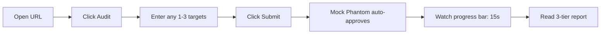
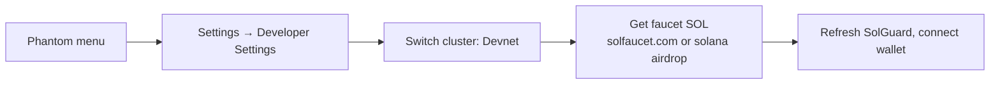

# SolGuard — User Guide

> Version: 0.7.0 (Phase 7) · [中文版](./USAGE.zh-CN.md)

This document is for people who want to **use** SolGuard — whether through the hosted demo or a self-hosted deployment.

---

## 1. Fastest path — Vercel Demo Mode

Open **[solguard-demo.vercel.app](https://solguard-demo.vercel.app/)** in any modern browser.



- **No wallet needed** — the demo installs a mock Phantom provider so the whole flow works without installing an extension.
- **No SOL needed** — the payment step is bypassed; you'll see the "Confirming…" state for ~1.5s then auto-advance.
- **Pre-generated reports** — the 3 cases bundled in `docs/case-studies/` are served regardless of what you paste into the form. This is intentional: the demo proves the **UI / product shape**, not the scanner.

To run a real audit, skip down to [§3 Self-host](#3-self-host-and-run-a-real-audit).

---

## 2. Input types

SolGuard accepts **4 input kinds** per target. You can mix types within one batch.

| Kind | Example | What we scan |
|---|---|---|
| **GitHub repo** | `https://github.com/coral-xyz/sealevel-attacks` | All `*.rs` files at default branch, up to ~5k LOC |
| **Program address** | `Fg6PaFpoGXkYsidMpWTK6W2BeZ7FEfcYkg476zPFsLnS` | Disassembled bytecode → pattern match (no source-level reasoning) |
| **Whitepaper / doc URL** | `https://arxiv.org/pdf/...` | Extract architecture claims for the AI analyzer to cross-reference |
| **Website / info link** | `https://mydapp.xyz` | Project metadata (README mining, claim extraction) |

You can also attach a free-form **More info** field per target — use it to tell the auditor about trusted authorities, expected off-chain flows, or known limitations.

---

## 3. Self-host and run a real audit

### Prerequisites

- **Node.js** ≥ 20
- **[uv](https://docs.astral.sh/uv/)** ≥ 0.4 (Python toolchain)
- **Solana CLI** (Devnet testing)
- **OpenHarness** (installed via `uv tool install openharness-ai`)
- One of: **Anthropic** or **OpenAI** API key
- (Optional) SMTP credentials for email delivery

### Setup

```bash
git clone https://github.com/Keybird0/SolGuard.git
cd SolGuard
bash scripts/setup.sh
```

Edit `.env`:

```bash
LLM_PROVIDER=openai         # or anthropic
OPENAI_API_KEY=sk-...
PAYMENT_RECIPIENT=<your devnet pubkey>
AUDIT_PRICE_SOL=0.001
FREE_AUDIT=false            # set true for local dev without wallet
```

### Run

```bash
cd solguard-server
npm run dev
# → http://localhost:3000
```

Open the URL, click **Audit**, enter your target, follow the same flow as the demo — except now the payment is real (Devnet SOL only costs faucet time) and the audit actually runs through OpenHarness.

### Switching Phantom to Devnet



1. Open Phantom, three-line menu → **Settings** → **Developer Settings** → **Testnet Mode** → choose **Devnet**.
2. Airdrop: `solana airdrop 2 <your pubkey> --url https://api.devnet.solana.com` or use [solfaucet.com](https://solfaucet.com).
3. Reload SolGuard — the cluster chip in the header should switch to "Devnet".

---

## 4. Reading the report

Every completed audit comes back as a **3-tier report** rendered across three tabs:

| Tab | Audience | Typical length |
|---|---|---|
| **Summary** | Executive · founder · PM | ≤ 1 page — "should we ship this?" |
| **Assessment** | Tech lead · reviewer | Full reasoning, code snippets, exploit paths, remediation |
| **Checklist** | Implementer | Concrete items sorted by severity, with verification plan |

The report is also available as raw Markdown at `GET /api/audit/:taskId/report.md` and as structured JSON at `GET /api/audit/:taskId/report.json`.

---

## 5. FAQ

### "Payment never confirmed" / stuck on Confirming

1. Verify the Phantom cluster matches the server cluster (UI header chip).
2. Check that the transaction actually broadcast: `solana confirm <signature> --url https://api.devnet.solana.com`.
3. If confirmed on-chain but SolGuard still spins, the backend poller may be behind. It will catch up within 30s. If not, hit `POST /api/audit/batch/:id/payment` manually with the signature.
4. Paid the wrong amount? SolGuard rejects the signature. Pay again at the exact `amountSol` shown on the Pay pane.

### "Report stays empty after Completed"

Reports are stored per task at `solguard-server/data/reports/<taskId>/`. If that directory is missing, the spawn subprocess likely failed. Check:

- `GET /api/audit/:taskId` — the `error` field contains the stderr excerpt.
- Server log `solguard-server/logs/server.log` or stdout.
- `healthz` — `checks.ohCli` should be `true`. If false, re-run `uv tool install openharness-ai`.

### "Scan taking forever"

Per-task timeout defaults to 5 minutes. If exceeded, task → `failed` with `error: "timeout"`. Tune via `AUDIT_TASK_TIMEOUT_MS` env var.

### "Email never arrived"

- Check spam.
- Verify SMTP env vars (`SMTP_HOST` / `SMTP_PORT` / `SMTP_USER` / `SMTP_PASS`).
- `GET /healthz` → `checks.smtp` should be `true`.
- Even if email fails, the report is always downloadable from the Report page.

### "Anchor version mismatch" when testing locally

The fixtures use Anchor 0.29. If you hit version errors, pin via `anchor-cli 0.29.0` in your `Cargo.toml`. SolGuard does not require you to build your own contract to audit it — the skill reads source only.

### "The Demo says Phantom is installed but I never installed it"

The demo deliberately installs a **mock Phantom provider** on `window.solana`. It exists only within that tab and cannot touch any real wallet. Close the tab and the mock is gone.

### "Demo Mode shows findings I didn't submit"

Demo Mode serves **3 fixed cases** regardless of what you type. This is to keep the demo reproducible and cheap. Self-host to audit your own code.

### "Can I bring my own LLM?"

Yes. Set `LLM_PROVIDER=anthropic` + `ANTHROPIC_API_KEY=…` or `LLM_PROVIDER=openai` + `OPENAI_API_KEY=…`. Other providers (Gemini, local Ollama) are on the roadmap — open an issue.

### "Can I skip payment for local development?"

Set `FREE_AUDIT=true` in `.env`. The submission skips the payment state entirely and moves straight to `paid`. **Do not enable this in production.**

### "How do I contribute a new rule?"

See [`CONTRIBUTING.md`](../CONTRIBUTING.md). Short answer: drop a new module under `skill/solana-security-audit-skill/tools/rules/`, add a fixture under `test-fixtures/contracts/`, wire it into `tools/solana_scan.py`, and run `uv run pytest`.

### "Mainnet support"

Set `SOLANA_CLUSTER=mainnet-beta` + `SOLANA_RPC_URL=<your RPC>`. **Charge real SOL** only behind a trusted deployment; the open demo should stay on Devnet.

### "GDPR / data retention"

Self-host: you own the data. Default retention is 30 days after which tasks auto-delete via `scripts/cleanup.sh` (opt-in cron). The hosted demo stores nothing server-side — all state is in-memory within your browser tab.

---

## 6. CLI usage (skill directly)

You can run the skill without the server for local experimentation:

```bash
cd skill/solana-security-audit-skill
uv run python tools/solana_scan.py \
  --input ../../test-fixtures/real-world/small/rw04_arbitrary_cpi.rs \
  --out /tmp/sg-report
ls /tmp/sg-report
# → risk_summary.md  assessment.md  checklist.md  report.json
```

The OpenHarness CLI path:

```bash
oh run \
  --skill ./skill/solana-security-audit-skill \
  --input-file test-fixtures/real-world/small/rw04_arbitrary_cpi.rs \
  --output-dir ./outputs/manual
```

---

## 7. Where to next

- [`ARCHITECTURE.md`](./ARCHITECTURE.md) — how the pieces fit together
- [`case-studies/`](./case-studies/) — 3 worked examples
- [`knowledge/solana-vulnerabilities.md`](./knowledge/solana-vulnerabilities.md) — per-rule deep dive
- [`demo/script.md`](./demo/script.md) — 5-minute walkthrough script
- [`../CONTRIBUTING.md`](../CONTRIBUTING.md) — add rules, fix bugs, ship PRs
