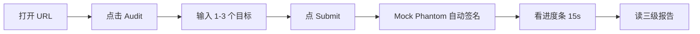
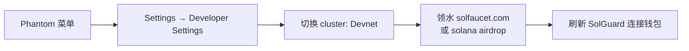

# SolGuard · 使用指南

> 版本：0.7.0（Phase 7）· [English](./USAGE.md)

本文面向**使用** SolGuard 的用户 — 不管是通过托管 demo，还是自托管部署。

---

## 1. 最快路径 · Vercel Demo Mode

打开 **[solguard-demo.vercel.app](https://solguard-demo.vercel.app/)**，任意现代浏览器都行。



- **不需要装钱包** — demo 注入了 mock Phantom provider，全流程无需安装扩展。
- **不需要 SOL** — 支付步骤被短路，你会看到 "Confirming…" 约 1.5s 后自动前进。
- **预生成报告** — 无论你在表单里输入什么，服务端都会回放 `docs/case-studies/` 下的 3 份案例。这是刻意设计的：demo 证明的是 **UI / 产品形态**，不是扫描器本身。

要跑真实扫描，看 [§3 自托管](#3-自托管跑真实审计)。

---

## 2. 输入类型

SolGuard 每个 target 支持 **4 类输入**，同一 batch 里可混用。

| 类型 | 示例 | 扫描什么 |
|---|---|---|
| **GitHub 仓库** | `https://github.com/coral-xyz/sealevel-attacks` | 默认分支下所有 `*.rs`，上限约 5k 行 |
| **程序地址** | `Fg6PaFpoGXkYsidMpWTK6W2BeZ7FEfcYkg476zPFsLnS` | 反汇编 bytecode → 模式匹配（不做源码级推理） |
| **白皮书 / 文档 URL** | `https://arxiv.org/pdf/...` | 抽取架构声明给 AI 分析器做交叉引用 |
| **网站 / 信息链接** | `https://mydapp.xyz` | 项目元信息（README mining、claim 抽取） |

每个 target 还可填一个自由文本 **More info** — 用它告诉审计器：谁是可信 authority、预期的链下流程、已知限制等。

---

## 3. 自托管跑真实审计

### 环境要求

- **Node.js** ≥ 20
- **[uv](https://docs.astral.sh/uv/)** ≥ 0.4（Python 工具链）
- **Solana CLI**（Devnet 联调）
- **OpenHarness**（`uv tool install openharness-ai`）
- 至少一个：**Anthropic** 或 **OpenAI** API key
- （可选）邮件投递需要 SMTP 凭据

### 初始化

```bash
git clone https://github.com/Keybird0/SolGuard.git
cd SolGuard
bash scripts/setup.sh
```

编辑 `.env`：

```bash
LLM_PROVIDER=openai         # 或 anthropic
OPENAI_API_KEY=sk-...
PAYMENT_RECIPIENT=<你的 devnet pubkey>
AUDIT_PRICE_SOL=0.01
FREE_AUDIT=false            # 本地无钱包联调时置 true
```

### 运行

```bash
cd solguard-server
npm run dev
# → http://localhost:3000
```

打开 URL，点 **Audit**，输入目标，走和 demo 一样的流程 — 这次支付是真的（Devnet SOL 从水龙头领即可免费），审计会真的跑 OpenHarness。

### Phantom 切到 Devnet



1. 打开 Phantom，右上角菜单 → **Settings** → **Developer Settings** → **Testnet Mode** → 选 **Devnet**。
2. 领水：`solana airdrop 2 <你的 pubkey> --url https://api.devnet.solana.com` 或去 [solfaucet.com](https://solfaucet.com)。
3. 刷新 SolGuard — 顶栏 cluster 徽章应该切成 "Devnet"。

---

## 4. 读懂报告

每个完成的审计回来都是一份 **三级报告**，分 3 个 tab：

| Tab | 受众 | 典型长度 |
|---|---|---|
| **Summary** | 高管 · 创始人 · PM | ≤ 1 页 — "这玩意能上线吗？" |
| **Assessment** | 技术 Lead · Reviewer | 完整推理、代码片段、攻击路径、修复方案 |
| **Checklist** | 实现者 | 按严重度排序的具体任务 + 验证计划 |

原始 Markdown：`GET /api/audit/:taskId/report.md`。结构化 JSON：`GET /api/audit/:taskId/report.json`。

---

## 5. FAQ

### "支付一直没确认" / 卡在 Confirming

1. 确认 Phantom 的 cluster 和 server 的 cluster 一致（UI 顶栏徽章）。
2. 链上真的广播了吗：`solana confirm <signature> --url https://api.devnet.solana.com`。
3. 链上已确认但 SolGuard 还在转圈，后端 poller 会在 30s 内赶上。实在没赶上就手动 `POST /api/audit/batch/:id/payment` 带上 signature。
4. 支付金额不对？SolGuard 会拒绝 signature。按 Pay 面板显示的 `amountSol` 重新支付。

### "状态是 Completed 但报告为空"

报告落盘在 `solguard-server/data/reports/<taskId>/`。目录缺失多半是 agent subprocess 失败。排查：

- `GET /api/audit/:taskId` — `error` 字段就是 stderr 摘要。
- Server 日志 `solguard-server/logs/server.log` 或 stdout。
- `healthz` — `checks.ohCli` 应为 `true`。如果是 false，重新 `uv tool install openharness-ai`。

### "扫描无限时间"

单任务超时默认 5 分钟。超时后 task → `failed`、`error: "timeout"`。通过 `AUDIT_TASK_TIMEOUT_MS` 调。

### "邮件一直没收到"

- 查垃圾箱。
- 检查 SMTP 环境变量（`SMTP_HOST` / `SMTP_PORT` / `SMTP_USER` / `SMTP_PASS`）。
- `GET /healthz` → `checks.smtp` 应为 `true`。
- 就算邮件失败，报告始终可以从 Report 页直接下载。

### "本地联调 Anchor 版本对不上"

Fixture 用 Anchor 0.29。版本错了在 `Cargo.toml` 里钉 `anchor-cli 0.29.0`。SolGuard 不要求你本地能 build 合约就能审计 — skill 只读源码。

### "Demo 说 Phantom 装好了但我没装过"

Demo 故意在 `window.solana` 上装了一个 **mock Phantom provider**，只在这个 tab 内生效，碰不到任何真实钱包。关 tab 就没了。

### "Demo Mode 显示的 finding 不是我提交的"

Demo Mode 无论你输什么都回放 **3 份固定案例**。是为了让 demo 可复现又便宜。要审自己的代码请自托管。

### "能换我自己的 LLM 吗？"

可以。`LLM_PROVIDER=anthropic` + `ANTHROPIC_API_KEY=…` 或 `LLM_PROVIDER=openai` + `OPENAI_API_KEY=…`。其他 provider（Gemini、本地 Ollama）在 roadmap — 开 issue。

### "本地开发能跳过支付吗？"

`.env` 里 `FREE_AUDIT=true`。提交会跳过 paying 状态直接到 `paid`。**生产环境别开。**

### "怎么贡献一条新规则？"

详见 [`CONTRIBUTING.md`](../CONTRIBUTING.md)。简短版：在 `skill/solana-security-audit-skill/tools/rules/` 扔一个新模块，在 `test-fixtures/contracts/` 加 fixture，接到 `tools/solana_scan.py`，`uv run pytest` 跑。

### "Mainnet 支持？"

`SOLANA_CLUSTER=mainnet-beta` + `SOLANA_RPC_URL=<你的 RPC>`。**真实 SOL 计费** 请只放在可信部署后面；开放 demo 留在 Devnet。

### "GDPR / 数据保留？"

自托管：数据在你手里。默认 30 天后通过 `scripts/cleanup.sh`（opt-in cron）自动删除。托管 demo 不在服务端存任何东西 — 所有状态都在你浏览器 tab 里的内存中。

---

## 6. CLI 用法（直接用 skill）

不起 server 也能本地实验：

```bash
cd skill/solana-security-audit-skill
uv run python tools/solana_scan.py \
  --input ../../test-fixtures/real-world/small/rw04_arbitrary_cpi.rs \
  --out /tmp/sg-report
ls /tmp/sg-report
# → risk_summary.md  assessment.md  checklist.md  report.json
```

OpenHarness CLI 路径：

```bash
oh run \
  --skill ./skill/solana-security-audit-skill \
  --input-file test-fixtures/real-world/small/rw04_arbitrary_cpi.rs \
  --output-dir ./outputs/manual
```

---

## 7. 继续阅读

- [`ARCHITECTURE.md`](./ARCHITECTURE.md) — 各部件怎么拼起来
- [`case-studies/`](./case-studies/) — 3 个完整案例
- [`knowledge/solana-vulnerabilities.md`](./knowledge/solana-vulnerabilities.md) — 每条规则的深度拆解
- [`demo/script.md`](./demo/script.md) — 5 分钟演示脚本
- [`../CONTRIBUTING.md`](../CONTRIBUTING.md) — 加规则、修 bug、发 PR
