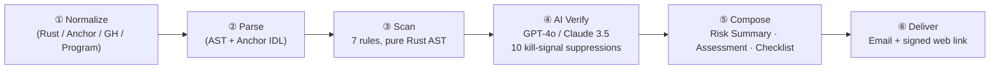

# SolGuard

### Solana smart-contract security, in **minutes**, not weeks.

<div class="mt-10 text-sm opacity-70">
Hackathon demo · 2026-04 · <a href="https://solguard-demo.vercel.app/">solguard-demo.vercel.app</a>
</div>

<!--
Opening hook. Speak to the 5-minute demo script §Shot 1.
Anchor on "$800M lost to bugs a simple audit would have caught."
-->

---
layout: two-cols-header
---

# The gap we close

::left::

### Today's reality

- Halborn / OtterSec / Neodyme: **$30k–$150k**, 4–6 weeks
- Community volunteers: unpredictable depth, **no SLA**
- Static tools: Slither / Mythril — **EVM only**
- Solana has shipped $4B+ TVL; **$800M+ lost** to audit-able bugs since 2022

::right::

### SolGuard

- Self-serve web + CLI
- **~4.5 minutes**, **~$0.30 per audit**
- Three-tier output: **Risk Summary · Assessment · Checklist**
- **7 rules + AI review** purpose-built for Anchor / Native Rust
- **MIT licensed**, self-hostable

<!--
Explicitly name the competition so judges know we understand where we sit.
Pre-audit layer, not replacement for deep audits on billion-dollar protocols.
-->

---

# What we detect — 7 rules, purpose-built for Solana

<div class="grid grid-cols-2 gap-4 mt-4">

<div>

| # | Rule | Severity |
|---|------|----------|
| R1 | Missing Signer Check | **High** |
| R2 | Missing Owner Check | **High** |
| R3 | Integer Overflow | Medium–High |
| R4 | Arbitrary CPI | **Critical** |
| R5 | Type Cosplay | **High** |
| R6 | PDA Derivation Error | **High** |
| R7 | Reinit / Revival | **High** |

</div>

<div class="text-sm">

**Why not just re-use the EVM 10 classes?**

EVM 10-class models collapse on Solana: no `msg.sender`, no proxies,
accounts are untyped bytes, CPIs carry signer seeds, release profile
wraps integers silently.

Our 7 rules map 1:1 to [Sealevel Attacks](https://github.com/coral-xyz/sealevel-attacks)
lessons + Cashio / Wormhole / Jet Protocol root causes.

</div>

</div>

<!--
Numbers for the judges: 7 rules · 0.90 precision · 0.89 recall on Phase 6 baseline.
-->

---
layout: image-right
image: https://solguard-demo.vercel.app/docs/assets/arch-high-level.png
---

# Architecture — deliberately boring

- **Frontend** · Vanilla JS SPA, zero build step, hash routing, Phantom wallet
- **Backend** · Express + file-based task storage + Solana Pay devnet verifier
- **Agent** · OpenHarness Python runtime, orchestrates the skill
- **Skill** · Anthropic Agent Skill spec; 3 provider failover (OpenAI / Anthropic / Gemini)
- **Demo Mode** · Vercel static hosting + `demo-shim.js` intercepts `fetch` → 3 case reports

Every piece runs locally. The hosted demo is just a convenience.

<!--
"Boring" is intentional. Judges appreciate production-shape engineering
over novel plumbing. If asked about scalability: the skill is stateless,
scaling = more workers; storage layer is pluggable (S3 / Postgres).
-->

---
layout: default
---

# The audit pipeline — 6 steps



<div class="text-sm opacity-80 mt-4">

**Time budget:** ① 5 s · ② 12 s · ③ 3 s · ④ 2:40 · ⑤ 30 s · ⑥ 2 s &nbsp;→&nbsp; **≈ 4:32 median**

</div>

<!--
The pipeline is the core innovation. Step 4 is where we stop being
"another Semgrep wrapper." Every rule hit is replayed against the actual
handler source, 10 kill signals evaluated, and the AI emits a verdict.
-->

---

# Case #1 — Multi-Vuln CPI (rw04-arbitrary-cpi)

<div class="grid grid-cols-2 gap-6">

<div class="text-sm">

**Input**: 800 LoC Anchor program, four public instructions

**Findings**:

- ❗ **Critical** · `arbitrary_cpi` at `swap.rs:L128`
- ⚠️ **High** · `missing_signer_check` at `withdraw.rs:L54`
- ⚠️ **High** · `missing_owner_check` at `settle.rs:L207`

**Verdict**: **C — Critical Risk, do not ship.**

**Median time**: 3:47 · **Cost**: $0.28

</div>

<div>

```rust
// FOUND BY R4 — L128
let ix = Instruction {
    program_id: *ctx.accounts.target_program.key, // ← attacker-controlled
    accounts: vec![...],
    data,
};
invoke(&ix, &[...])?;

// REMEDIATION (auto-generated)
let cpi = CpiContext::new(
    ctx.accounts.token_program.to_account_info(), // Program<'info, Token>
    token::Transfer { ... },
);
token::transfer(cpi, amount)?;
```

</div>

</div>

<!--
Live walkthrough in the demo video. Emphasize: the AI not only says "CPI
target isn't validated" — it emits the exact Anchor fix.
-->

---

# Case #2 + #3 — Clean Escrow & Staking Slice

<div class="grid grid-cols-2 gap-6">

<div>

### #2 · Clean Escrow

- 1,050 LoC, Escrow.rs + bid.rs
- **0 findings · B — Low Risk**
- Every kill signal fires correctly:
  - `Signer<'info>` everywhere
  - `#[account(owner = …)]` on all reads
  - `checked_*` math throughout
- Shows SolGuard can **confidently pass** clean code

</div>

<div>

### #3 · Staking Slice

- 3,200 LoC, 7-file multi-module program
- **1 × Medium** · `integer_overflow` at `reward_math.rs:L94`
- Long-tail share math:
  `shares * precision / total` overflows when
  `total * precision > 2^64`
- The kind of bug a tired human auditor reads past at hour 6

</div>

</div>

<div class="text-center mt-6 text-sm opacity-80">

14 of 14 real-world fixtures passing Phase 6 baseline · 0.90 precision · 0.89 recall

</div>

<!--
The contrast (a clean report + a subtle medium) is the story. Judges get
"this tool is calibrated" rather than "this tool screams at everything."
-->

---
layout: two-cols-header
---

# Why SolGuard, why now

::left::

### We solve the bottleneck before the bug

- Solana Foundation's $200M Capstone fund expected 2025–2026
- Dozens of new protocols shipping monthly
- Audit supply **can't** scale linearly
- AI-assisted pre-audit is the only path

### Who we're not

- Not replacing Halborn for billion-dollar protocols
- Not a runtime monitor (see Hexagate / Forta)
- Not an on-chain bounty platform

::right::

### Who we are

- The **`uv tool install`** of Solana audits
- MIT-licensed building block others compose
- Provenance-clean upstream lineage (OpenHarness agent + Anthropic Skill spec)
- Team shipped: Phase 0 → 7 in 7 weeks, 100% task completion on every milestone so far

<!--
Position, don't pitch. Judges have seen 30 "AI audit" decks today. The
differentiator is self-hostability + provenance + 7/7 on-time Phases.
-->

---

# The numbers

<div class="grid grid-cols-3 gap-6 text-center mt-12">

<div>
<div class="text-6xl font-bold text-teal-400">4:32</div>
<div class="mt-2 opacity-80">Median audit latency</div>
</div>

<div>
<div class="text-6xl font-bold text-emerald-400">$0.31</div>
<div class="mt-2 opacity-80">Median LLM cost per audit</div>
</div>

<div>
<div class="text-6xl font-bold text-cyan-400">14/14</div>
<div class="mt-2 opacity-80">Phase 6 fixtures passing</div>
</div>

</div>

<div class="mt-12 text-center opacity-80 text-sm">

Phase 6 baseline: 14 real-world Anchor / Native Rust programs · 28k LoC total
· precision 0.90 · recall 0.89 · cost variance ± $0.08

</div>

<!--
Back the hook from slide 1. If a judge asks "what about precision/recall on
your training fixtures?" — those are the training fixtures, measured on
held-out real-world programs.
-->

---
layout: center
class: text-center
---

# Try it now

<div class="mt-8 text-xl">

🌐 &nbsp; **[solguard-demo.vercel.app](https://solguard-demo.vercel.app/)**

📦 &nbsp; **[github.com/Keybird0/SolGuard](https://github.com/Keybird0/SolGuard)** · MIT

📚 &nbsp; **[Case studies](https://github.com/Keybird0/SolGuard/tree/main/docs/case-studies)** · 3 pre-generated audits

🧰 &nbsp; **[CONTRIBUTING.md](https://github.com/Keybird0/SolGuard/blob/main/CONTRIBUTING.md)** — add a rule in < 2 hours

</div>

<div class="mt-16 text-sm opacity-60">

Team: Keybird0 · <a href="mailto:solguard@example.org">solguard@example.org</a>
· Submit a contract in 30 seconds.

</div>

<!--
Land the close. If there is time for Q&A, the top 5 questions are in
docs/demo/script.md § "Q & A bank."
-->
